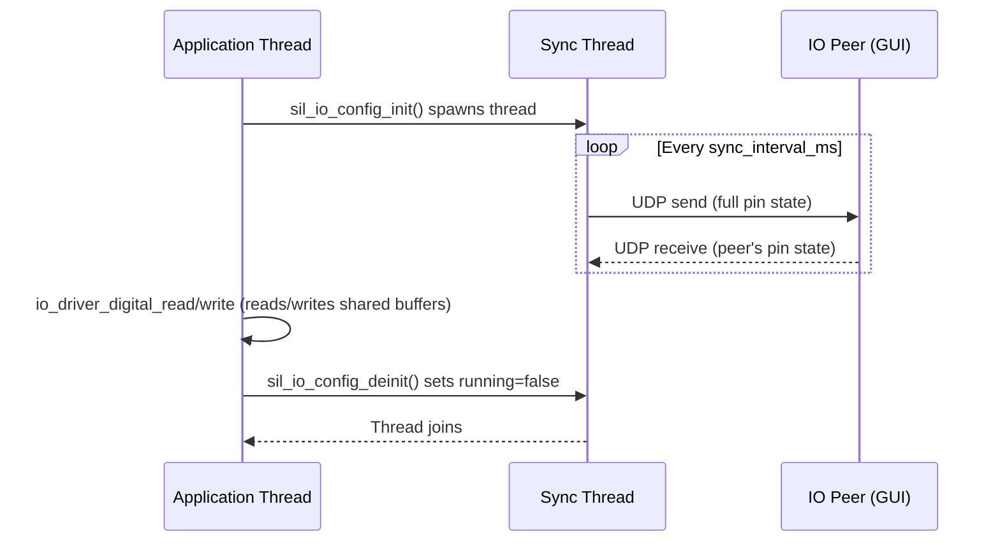
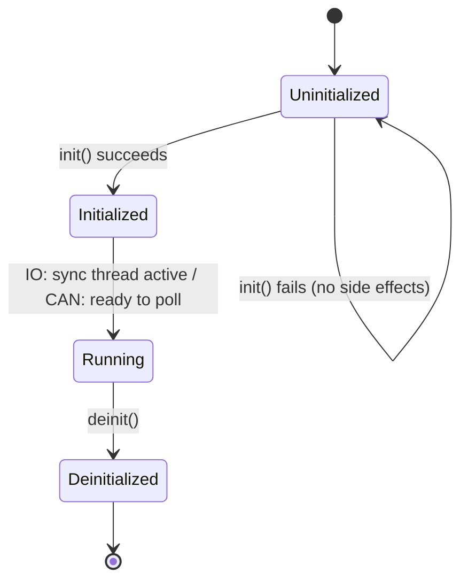

# SilLib Integration Guide

This guide provides in-depth integration instructions for consumers of SilLib.
For a quick-start overview, see the [README](../sil_lib/README.md).

---

## Table of Contents

1. [Build Integration](#build-integration)
2. [IO Path — Detailed Walkthrough](#io-path--detailed-walkthrough)
3. [CAN Path — Detailed Walkthrough](#can-path--detailed-walkthrough)
4. [Multi-Instance and Multi-Bus Configuration](#multi-instance-and-multi-bus-configuration)
5. [Threading Model](#threading-model)
6. [Troubleshooting](#troubleshooting)
7. [Complete Annotated Example](#complete-annotated-example)

---

## Build Integration

SilLib supports three integration strategies.  Choose the one that fits your
project layout.

### Option A: `find_package` (recommended)

The cleanest approach — point CMake at an installed or unpacked SilLib tree.

```cmake
cmake_minimum_required(VERSION 3.16)
project(my_app C)

find_package(SilLib 1.0 REQUIRED)

add_executable(my_app main.c)
target_link_libraries(my_app PRIVATE SilLib::sil_lib)
```

Configure with:

```powershell
cmake -S . -B build -G Ninja -DCMAKE_PREFIX_PATH="<path-to-SilLib>"
```

`find_package` imports the `SilLib::sil_lib` target, which carries:

- Include directories (`include/sil_lib/`)
- The static library (`lib/libsil_lib.a`)
- Platform link dependencies (`ws2_32` on Windows)

Version compatibility uses the `SameMajorVersion` policy — any 1.x.y release
satisfies `find_package(SilLib 1.0 REQUIRED)`.

### Option B: `add_subdirectory`

Embed the SilLib source tree directly in your project.  Useful during
co-development when you need to modify SilLib alongside your application.

```
my_project/
├── CMakeLists.txt
├── main.c
└── sil_lib/          ← copy or git submodule
```

```cmake
cmake_minimum_required(VERSION 3.16)
project(my_app C)

# These variables must be set before add_subdirectory because
# sil_lib/CMakeLists.txt references them for include paths.
set(SIL_LIB_ROOT    ${CMAKE_CURRENT_SOURCE_DIR}/sil_lib)
set(SIL_IO_CONFIG_ROOT    ${SIL_LIB_ROOT}/io)
set(SIL_VCAN_CONFIG_ROOT  ${SIL_LIB_ROOT}/vcan)
set(UDP_SOCKET_ROOT       ${SIL_LIB_ROOT}/udp_socket)
set(IO_TRANSPORT_UDP_ROOT ${SIL_LIB_ROOT}/io/io_transport_udp)
set(CAN_TRANSPORT_UDP_ROOT ${SIL_LIB_ROOT}/vcan/can_transport_udp)

# Platform socket library
set(UDP_SOCKET_PLATFORM_LIBS)
if(WIN32)
    list(APPEND UDP_SOCKET_PLATFORM_LIBS ws2_32)
endif()

# Provide the output-layout function (no-op is fine outside the main repo)
function(set_module_output_layout target path)
endfunction()

add_subdirectory(sil_lib)

add_executable(my_app main.c)
target_link_libraries(my_app PRIVATE sil_lib)
```

> **Note:** With `add_subdirectory`, the target name is `sil_lib` (no
> namespace).  The `SilLib::sil_lib` alias is only available through the
> installed package.

### Option C: Manual linking

If you cannot use CMake's package system, link manually:

```cmake
add_executable(my_app main.c)

target_include_directories(my_app PRIVATE /path/to/SilLib/include/sil_lib)
target_link_libraries(my_app PRIVATE /path/to/SilLib/lib/libsil_lib.a)

if(WIN32)
    target_link_libraries(my_app PRIVATE ws2_32)
endif()
```

Or with a non-CMake build system:

```makefile
CFLAGS  += -I/path/to/SilLib/include/sil_lib
LDFLAGS += -L/path/to/SilLib/lib -lsil_lib
# Windows: add -lws2_32
```

---

## IO Path — Detailed Walkthrough

The IO path simulates digital and analog GPIO pins over UDP.  A background
sync thread periodically exchanges the full pin state with a remote peer
(typically the IO GUI plant simulator).

### Initialization

```c
#include "sil_io_config.h"
#include <stdio.h>

SilIoConfig io = {0};

const SilIoConfigParams params = {
    .local_port        = 9010,    // This process listens here
    .remote_ip         = "127.0.0.1",
    .remote_port       = 9011,    // Peer (GUI) listens here
    .sync_interval_ms  = 10,      // 100 Hz exchange rate
    .digital_pin_count = 4,
    .analog_pin_count  = 2,
};

if (!sil_io_config_init(&io, &params))
{
    fprintf(stderr, "IO init failed (port %u in use?)\n", params.local_port);
    // Handle error — no cleanup needed on failure
    return -1;
}
```

`sil_io_config_init` performs the following steps internally:

1. Allocates internal state (`SilIoInternal`)
2. Allocates pin buffers (`digital_buf[N]`, `analog_buf[M]`)
3. Opens a UDP socket on `local_port` with a 1 ms receive timeout
4. Initializes the IO transport layer
5. Wires the `IoDriver` vtable (digital/analog read/write callbacks)
6. Starts the sync thread

If any step fails, all previously allocated resources are freed and the
function returns `false`.  You do **not** need to call `deinit` after a
failed `init`.

### Getting the driver

```c
IoDriver *gpio = sil_io_config_get_driver(&io);
if (gpio == NULL)
{
    fprintf(stderr, "IO not initialized\n");
    return -1;
}
```

The returned pointer is valid until `sil_io_config_deinit()` is called.
Do not free it yourself.

### Runtime API

All pin operations are thread-safe — the sync thread and your application
thread access the same buffers.

```c
// Digital read
bool button_pressed;
if (!io_driver_digital_read(gpio, 0, &button_pressed))
{
    fprintf(stderr, "digital_read failed (pin out of range?)\n");
}

// Digital write
if (!io_driver_digital_write(gpio, 1, true))
{
    fprintf(stderr, "digital_write failed\n");
}

// Analog read (16-bit unsigned)
uint16_t sensor_value;
if (!io_driver_analog_read(gpio, 0, &sensor_value))
{
    fprintf(stderr, "analog_read failed\n");
}

// Analog write
if (!io_driver_analog_write(gpio, 0, 4095))
{
    fprintf(stderr, "analog_write failed\n");
}
```

Pin indices are zero-based.  Reads/writes to pins beyond the configured count
return `false`.

### Cleanup

```c
sil_io_config_deinit(&io);
// After this call:
// - The sync thread has been joined
// - The UDP socket is closed
// - All internal memory is freed
// - gpio pointer is now invalid
```

`deinit` is safe to call on a zero-initialized or already-deinitialized
`SilIoConfig` — it is a no-op in that case.

---

## CAN Path — Detailed Walkthrough

The CAN path simulates a CAN bus using a local bus emulator and a UDP link to
a remote peer.  Unlike the IO path, CAN reception is **polled** — there is no
background thread.

### Initialization

```c
#include "sil_vcan_config.h"
#include <stdio.h>

SilVcanConfig vcan = {0};

const SilVcanConfigParams params = {
    .local_port  = 9000,          // This process listens here
    .remote_ip   = "127.0.0.1",
    .remote_port = 9001,          // Peer listens here
    .timeout_ms  = 50,            // Receive blocks up to 50 ms
};

if (!sil_vcan_config_init(&vcan, &params))
{
    fprintf(stderr, "vCAN init failed (port %u in use?)\n", params.local_port);
    return -1;
}
```

`sil_vcan_config_init` performs the following steps:

1. Allocates internal state (`SilVcanInternal`)
2. Opens a UDP socket on `local_port` with `timeout_ms` receive timeout
3. Initializes the CAN-over-UDP transport
4. Creates a CAN bus emulator (2 nodes, 16-deep TX/RX queues)
5. Registers LOCAL (node 0) and REMOTE (node 1) on the virtual bus
6. Wires the `CanDriver` vtable (send/receive/close callbacks)

### Getting the driver

```c
CanDriver *can = sil_vcan_config_get_driver(&vcan);
if (can == NULL)
{
    fprintf(stderr, "vCAN not initialized\n");
    return -1;
}
```

### Sending a CAN frame

```c
CanFrame tx_frame;
can_frame_clear(&tx_frame);
tx_frame.id  = 0x18FEF100;   // 29-bit extended ID
tx_frame.dlc = 8;
tx_frame.data[0] = 0xAA;
tx_frame.data[1] = 0xBB;
// data[2..7] remain zero from can_frame_clear

if (!can_driver_send(can, &tx_frame))
{
    fprintf(stderr, "CAN send failed\n");
}
```

Internally, `send` performs:

1. Submit the frame to the LOCAL node's TX queue
2. Step the emulator until all pending TX entries are delivered
3. Drain the REMOTE node's RX queue
4. Serialize each drained frame and send it via UDP

### Receiving a CAN frame

```c
CanFrame rx_frame;
if (can_driver_receive(can, &rx_frame))
{
    printf("Received CAN ID=0x%08X DLC=%u\n", rx_frame.id, rx_frame.dlc);
}
else
{
    // No frame available within timeout_ms — this is normal
}
```

Internally, `receive` performs:

1. Pull one UDP datagram (blocks up to `timeout_ms`)
2. Decode and submit it to the REMOTE node's TX queue
3. Step the emulator
4. Dequeue one frame from the LOCAL node's RX queue

If no UDP data arrives within the timeout, the function returns `false`.
This is not an error — poll again in your main loop.

### Cleanup

```c
sil_vcan_config_deinit(&vcan);
// Socket closed, emulator freed, can pointer invalid
```

---

## Multi-Instance and Multi-Bus Configuration

Each `SilIoConfig` and `SilVcanConfig` is fully independent.  You can create
multiple instances to simulate complex systems.

### Multiple CAN buses

```c
// Bus 1: implement ↔ tractor ECU
SilVcanConfig bus1 = {0};
const SilVcanConfigParams bus1_p = {
    .local_port = 9000, .remote_ip = "127.0.0.1",
    .remote_port = 9001, .timeout_ms = 50,
};
sil_vcan_config_init(&bus1, &bus1_p);

// Bus 2: implement ↔ section controller
SilVcanConfig bus2 = {0};
const SilVcanConfigParams bus2_p = {
    .local_port = 9002, .remote_ip = "127.0.0.1",
    .remote_port = 9003, .timeout_ms = 50,
};
sil_vcan_config_init(&bus2, &bus2_p);

CanDriver *can_tractor  = sil_vcan_config_get_driver(&bus1);
CanDriver *can_sections = sil_vcan_config_get_driver(&bus2);
```

### Multiple IO channels

```c
SilIoConfig io_main   = {0};
SilIoConfig io_aux    = {0};

const SilIoConfigParams main_p = {
    .local_port = 9010, .remote_ip = "127.0.0.1", .remote_port = 9011,
    .sync_interval_ms = 10, .digital_pin_count = 8, .analog_pin_count = 4,
};
const SilIoConfigParams aux_p = {
    .local_port = 9012, .remote_ip = "127.0.0.1", .remote_port = 9013,
    .sync_interval_ms = 50, .digital_pin_count = 2, .analog_pin_count = 1,
};

sil_io_config_init(&io_main, &main_p);
sil_io_config_init(&io_aux, &aux_p);
```

### Port assignment rules

- Every config must have a **unique `local_port`** — two sockets cannot
  bind to the same port.
- Port pairs should not overlap (i.e. one config's `local_port` should not
  be another config's `remote_port` on the same machine).
- Suggested convention:

  | Resource | Port range |
  |----------|-----------|
  | CAN buses | 9000–9009 (pairs: 9000/9001, 9002/9003, …) |
  | IO channels | 9010–9019 (pairs: 9010/9011, 9012/9013, …) |

### Multiple nodes on one CAN bus

A single UDP link between two processes already simulates two CAN nodes
(LOCAL and REMOTE).  The remote process simply uses different CAN IDs.
The emulator handles arbitration ordering so frames are delivered in
priority order.

If you need more than two nodes on one bus, run additional processes, each
with its own `SilVcanConfig` using a separate port pair but with the same
logical peer.

---

## Threading Model

### IO path

`sil_io_config_init()` spawns **one background thread** — the sync thread.
Its loop is:

```
while (running):
    io_transport_udp_receive()     ← pull peer's pin state (1 ms timeout)
    io_transport_udp_send()        ← push our pin state to peer
    sleep(sync_interval_ms)
```



**Key points:**

- The sync thread and application thread share the pin buffers.
  `digital_read`/`analog_read` access the latest values written by the
  sync thread's receive step.  `digital_write`/`analog_write` update
  values that the sync thread's send step will transmit next cycle.
- The receive timeout is hardcoded to 1 ms — the sync thread never blocks
  for long even if the peer is not running.
- `deinit` sets a `volatile bool running` flag to `false`, then joins the
  thread.  The thread will exit within at most `sync_interval_ms + 1` ms.

### CAN path

The CAN path has **no background thread**.  All work happens synchronously
in `can_driver_send()` and `can_driver_receive()` on the caller's thread.

`can_driver_receive()` may block up to `timeout_ms` waiting for a UDP
datagram.  If your application needs non-blocking CAN reception, set
`timeout_ms` to 0 or 1 and poll in your main loop.

### Lifecycle summary



---

## Troubleshooting

### Port already in use

**Symptom:** `sil_io_config_init()` or `sil_vcan_config_init()` returns
`false`.

**Cause:** Another process (or a previous crashed instance) is holding the
UDP port.

**Fix:**

```powershell
# Find what's using the port (Windows)
netstat -ano | findstr :9010

# Kill the process or choose a different port
```

On Linux:

```bash
ss -ulnp | grep 9010
```

### Peer not receiving data

**Symptom:** The GUI shows no pin updates, or `can_driver_receive()` always
times out.

**Checklist:**

1. Verify port pairs match: your `local_port` should equal the peer's
   `remote_port`, and vice versa.
2. Check firewall rules — Windows Firewall may block UDP traffic even on
   localhost.
3. Ensure both processes are running simultaneously.

### Winsock errors on Windows

**Symptom:** Socket operations fail with obscure error codes.

**Note:** SilLib calls `WSAStartup` internally (ref-counted).  However, if
your application also calls `WSAStartup`/`WSACleanup`, ensure the calls are
balanced.  Calling `WSACleanup` before SilLib's `deinit` will break the
library's sockets.

### Timeout tuning

| Parameter | Too low | Too high |
|-----------|---------|----------|
| `sync_interval_ms` (IO) | High CPU usage, unnecessary network traffic | Slow pin updates, laggy GUI |
| `timeout_ms` (CAN) | Frequent false "no frame" returns | `can_driver_receive()` blocks your main loop |

**Recommended values:**

- `sync_interval_ms`: 10–50 ms (10 ms for real-time feel, 50 ms for low load)
- `timeout_ms`: 10–100 ms (match to your application's CAN polling rate)

### Build errors: unresolved symbols

If you see linker errors for `WSAStartup`, `socket`, `sendto`, etc.:

- **Windows:** Ensure `ws2_32` is linked.  With `find_package(SilLib)` this
  is automatic.  With manual linking, add `-lws2_32`.
- **Linux:** Ensure your compiler supports `pthread` (GCC links it by
  default in most configurations).

---

## Complete Annotated Example

The following program initializes both the IO and CAN paths, runs a short
control loop, then shuts down cleanly.

```c
#include "sil_io_config.h"
#include "sil_vcan_config.h"
#include "sil_lib_version.h"
#include <stdio.h>
#include <stdlib.h>
#include <stdbool.h>

// Forward declaration for the control loop
static void run_control_loop(IoDriver *gpio, CanDriver *can, int iterations);

int main(void)
{
    printf("SilLib %s — integration example\n\n", SIL_LIB_VERSION_STRING);

    // ── 1. Initialize virtual CAN bus ──────────────────────────────
    SilVcanConfig vcan = {0};
    const SilVcanConfigParams vcan_params = {
        .local_port  = 9000,        // We listen on 9000
        .remote_ip   = "127.0.0.1", // Peer is on localhost
        .remote_port = 9001,        // Peer listens on 9001
        .timeout_ms  = 20,          // 20 ms receive timeout
    };

    if (!sil_vcan_config_init(&vcan, &vcan_params))
    {
        fprintf(stderr, "ERROR: vCAN init failed on port %u\n",
                vcan_params.local_port);
        return EXIT_FAILURE;
    }
    printf("[init] vCAN ready on port %u\n", vcan_params.local_port);

    CanDriver *can = sil_vcan_config_get_driver(&vcan);

    // ── 2. Initialize virtual IO ───────────────────────────────────
    SilIoConfig io = {0};
    const SilIoConfigParams io_params = {
        .local_port        = 9010,
        .remote_ip         = "127.0.0.1",
        .remote_port       = 9011,
        .sync_interval_ms  = 10,    // 100 Hz sync rate
        .digital_pin_count = 4,     // 4 digital pins (0–3)
        .analog_pin_count  = 2,     // 2 analog pins (0–1)
    };

    if (!sil_io_config_init(&io, &io_params))
    {
        fprintf(stderr, "ERROR: IO init failed on port %u\n",
                io_params.local_port);
        // Clean up the CAN path that already succeeded
        sil_vcan_config_deinit(&vcan);
        return EXIT_FAILURE;
    }
    printf("[init] IO ready on port %u  (%zu digital, %zu analog)\n",
           io_params.local_port,
           io_params.digital_pin_count,
           io_params.analog_pin_count);

    IoDriver *gpio = sil_io_config_get_driver(&io);

    // ── 3. Run application logic ───────────────────────────────────
    printf("\n[loop] Starting control loop...\n");
    run_control_loop(gpio, can, 100);
    printf("[loop] Done.\n");

    // ── 4. Cleanup (reverse order of init) ─────────────────────────
    sil_io_config_deinit(&io);      // Stops sync thread, closes socket
    sil_vcan_config_deinit(&vcan);  // Closes socket, frees emulator
    printf("\n[shutdown] All resources released.\n");

    return EXIT_SUCCESS;
}

static void run_control_loop(IoDriver *gpio, CanDriver *can, int iterations)
{
    for (int i = 0; i < iterations; i++)
    {
        // ── Read sensor inputs ─────────────────────────────────────
        bool     enable_switch;
        uint16_t speed_setpoint;

        io_driver_digital_read(gpio, 0, &enable_switch);
        io_driver_analog_read(gpio, 0, &speed_setpoint);

        // ── Compute control output ─────────────────────────────────
        uint16_t pwm_output = enable_switch ? speed_setpoint : 0;
        io_driver_analog_write(gpio, 1, pwm_output);

        // ── Report status on CAN ───────────────────────────────────
        CanFrame status = {0};
        status.id  = 0x18FF0100;
        status.dlc = 4;
        status.data[0] = (uint8_t)(i & 0xFF);            // loop counter
        status.data[1] = enable_switch ? 1 : 0;
        status.data[2] = (uint8_t)(pwm_output & 0xFF);   // PWM low byte
        status.data[3] = (uint8_t)(pwm_output >> 8);     // PWM high byte

        can_driver_send(can, &status);

        // ── Check for incoming CAN commands ────────────────────────
        CanFrame rx;
        if (can_driver_receive(can, &rx))
        {
            printf("  [rx] CAN 0x%08X  DLC=%u\n", rx.id, rx.dlc);
        }
    }
}
```

**Build and run:**

```powershell
cmake -S . -B build -G Ninja -DCMAKE_PREFIX_PATH="<path-to-SilLib>"
cmake --build build
.\build\my_app.exe
```

Start the IO GUI in a second terminal to provide pin stimuli:

```powershell
python tools\io_gui.py
```

---

## See Also

- [README](../sil_lib/README.md) — Quick-start overview and API tables
- [SDD\_sil\_lib.md](../sil_lib/SDD_sil_lib.md) — System architecture and design
- [SDD\_sil\_io.md](../sil_lib/io/SDD_sil_io.md) — IO subsystem design
- [SDD\_sil\_vcan.md](../sil_lib/vcan/SDD_sil_vcan.md) — Virtual CAN subsystem design
- [SDD\_sil\_udp\_socket.md](../sil_lib/udp_socket/SDD_sil_udp_socket.md) — UDP socket layer design
- [SDD\_sil\_can\_emulator.md](../sil_lib/vcan/can_emulator/SDD_sil_can_emulator.md) — CAN bus emulator design

All design documents are shipped in the release archive under `share/doc/SilLib/design/`.
