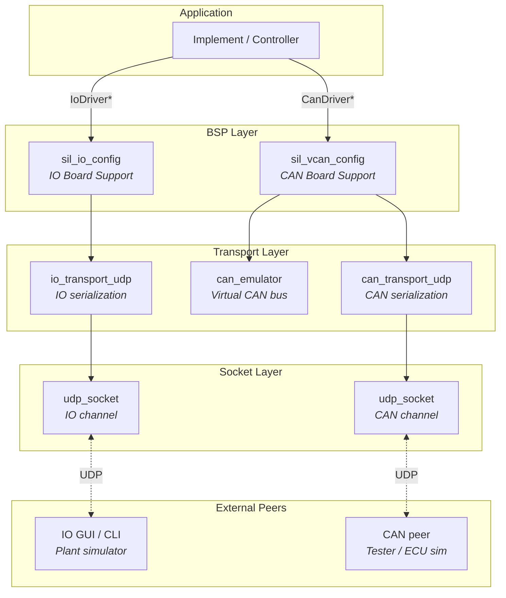

# SilLib

**Software-in-the-Loop library for agricultural implement development.**


---

## Overview

SilLib provides a drop-in simulation layer that replaces real hardware
peripherals with UDP-based virtual peripherals, enabling full
Software-in-the-Loop testing of agricultural implement controllers on a
developer workstation.  It targets embedded C applications that talk to CAN
buses and digital/analog IO — the library supplies the same `CanDriver` and
`IoDriver` interfaces the production code already uses, so switching between
real hardware and the SIL environment is a one-line configuration change.



Two independent communication paths are available:

| Path | Purpose | Peer |
|------|---------|------|
| **IO path** | Digital & analog pin simulation | GUI plant simulator or CLI tool |
| **CAN path** | CAN bus simulation via virtual bus emulator | ECU simulator or test harness |

---

## Quick Start

### 1. Obtain the library

**From a CPack package** — unpack the release archive:

```powershell
Expand-Archive SilLib-1.0.0-win64.zip -DestinationPath SilLib
```

**From source** — see [Building From Source](#building-from-source) below.

### 2. Create a CMake project

```cmake
cmake_minimum_required(VERSION 3.16)
project(my_app C)

find_package(SilLib REQUIRED)

add_executable(my_app main.c)
target_link_libraries(my_app PRIVATE SilLib::sil_lib)
```

### 3. Configure and build

```powershell
cmake -S . -B build -G Ninja -DCMAKE_PREFIX_PATH="<path-to-SilLib>"
cmake --build build
```

### 4. Minimal usage example

```c
#include "sil_io_config.h"
#include "sil_vcan_config.h"
#include "sil_lib_version.h"
#include <stdio.h>

int main(void)
{
    printf("SilLib %s\n", SIL_LIB_VERSION_STRING);

    /* --- Virtual CAN bus --- */
    SilVcanConfig vcan = {0};
    const SilVcanConfigParams vcan_p = {
        .local_port      = 9000,
        .remote_ip       = "127.0.0.1",
        .remote_port     = 9001,
        .timeout_ms      = 50,
        .max_pending_tx  = 16,
        .max_rx_queue    = 16,
    };
    sil_vcan_config_init(&vcan, &vcan_p);
    CanDriver *can = sil_vcan_config_get_driver(&vcan);

    /* --- Virtual IO --- */
    SilIoConfig io = {0};
    const SilIoConfigParams io_p = {
        .local_port        = 9010,
        .remote_ip         = "127.0.0.1",
        .remote_port       = 9011,
        .sync_interval_ms  = 10,
        .digital_pin_count = 4,
        .analog_pin_count  = 2,
    };
    sil_io_config_init(&io, &io_p);
    IoDriver *gpio = sil_io_config_get_driver(&io);

    /* Use the drivers exactly like real hardware */
    bool     btn;   io_driver_digital_read(gpio, 0, &btn);
    uint16_t adc;   io_driver_analog_read(gpio, 0, &adc);
    CanFrame tx = { .id = 0x18FEF100, .dlc = 8, .data = {0} };
    can_driver_send(can, &tx);

    /* Cleanup */
    sil_io_config_deinit(&io);
    sil_vcan_config_deinit(&vcan);
    return 0;
}
```

---

## API at a Glance

### IO Path

| Function | Description |
|----------|-------------|
| `sil_io_config_init()` | Create IO transport infrastructure and start the sync thread |
| `sil_io_config_get_driver()` | Retrieve the `IoDriver*` pointer for pin access |
| `sil_io_config_deinit()` | Stop the sync thread and release all resources |
| `io_driver_digital_read()` | Read a digital pin value |
| `io_driver_digital_write()` | Write a digital pin value |
| `io_driver_analog_read()` | Read an analog pin value (16-bit) |
| `io_driver_analog_write()` | Write an analog pin value (16-bit) |
| `io_driver_close()` | Close the driver (called internally by deinit) |

### CAN Path

| Function | Description |
|----------|-------------|
| `sil_vcan_config_init()` | Create socket, emulator, transport, and CAN driver |
| `sil_vcan_config_get_driver()` | Retrieve the `CanDriver*` pointer for frame TX/RX |
| `sil_vcan_config_deinit()` | Release all virtual CAN resources |
| `can_driver_send()` | Transmit a CAN frame through the virtual bus |
| `can_driver_receive()` | Receive a CAN frame (polled, subject to socket timeout) |
| `can_driver_close()` | Close the driver (called internally by deinit) |

### Supporting

| Function / Macro | Description |
|------------------|-------------|
| `can_frame_is_valid()` | Validate a CAN frame (DLC ≤ 8) |
| `can_frame_clear()` | Zero-initialize a CAN frame |
| `can_frame_copy()` | Deep-copy a CAN frame |
| `CAN_FRAME_MAX_DATA_LEN` | Maximum CAN data length (8) |
| `SIL_LIB_VERSION_STRING` | Version string, e.g. `"1.0.0"` |
| `SIL_LIB_VERSION_MAJOR` | Major version number |
| `SIL_LIB_VERSION_MINOR` | Minor version number |
| `SIL_LIB_VERSION_PATCH` | Patch version number |

---

## Configuration Parameters

### SilIoConfigParams

| Field | Type | Description | Example |
|-------|------|-------------|---------|
| `local_port` | `uint16_t` | UDP port this side listens on | `9010` |
| `remote_ip` | `const char*` | IP address of the IO peer | `"127.0.0.1"` |
| `remote_port` | `uint16_t` | UDP port the IO peer listens on | `9011` |
| `sync_interval_ms` | `uint32_t` | Milliseconds between send/receive cycles | `10` |
| `digital_pin_count` | `size_t` | Number of digital IO pins to simulate | `4` |
| `analog_pin_count` | `size_t` | Number of analog IO pins to simulate | `2` |

### SilVcanConfigParams

| Field | Type | Description | Example |
|-------|------|-------------|---------|
| `local_port` | `uint16_t` | UDP port this side listens on | `9000` |
| `remote_ip` | `const char*` | IP address of the CAN peer | `"127.0.0.1"` |
| `remote_port` | `uint16_t` | UDP port the CAN peer listens on | `9001` |
| `timeout_ms` | `uint32_t` | Socket receive timeout in milliseconds | `50` || `max_pending_tx` | `size_t` | Maximum pending TX frames awaiting arbitration | `16` |
| `max_rx_queue` | `size_t` | Maximum receive queue depth per emulator node | `16` |
---

## Port Assignment

Each SilLib subsystem uses one UDP port pair (local ↔ remote).  The convention
for single-instance setups:

| Subsystem | Application port | Peer port |
|-----------|-----------------|-----------|
| CAN bus   | 9000            | 9001      |
| IO        | 9010            | 9011      |

When running **multiple instances** on the same machine, assign non-overlapping
port pairs:

```
Instance A:  CAN 9000↔9001   IO 9010↔9011
Instance B:  CAN 9002↔9003   IO 9012↔9013
```

Each `SilVcanConfig` / `SilIoConfig` is fully independent — multiple CAN buses
or IO channels can coexist in a single process by creating multiple configs with
distinct port pairs.

---

## Wire Protocols

<details>
<summary><strong>IO-over-UDP Protocol</strong></summary>

Each datagram carries the full IO pin state (no deltas).  The sync thread
exchanges one datagram per cycle in each direction.

**Byte layout:**

| Offset | Size | Field | Value |
|--------|------|-------|-------|
| 0 | 1 | Magic `'I'` | `0x49` |
| 1 | 1 | Magic `'O'` | `0x4F` |
| 2 | 1 | Version | `1` |
| 3 | 1 | Digital pin count | N |
| 4 | 1 | Analog pin count | M |
| 5 | 1 | Reserved | `0` |
| 6 | N | Digital values | 1 byte per pin (`0x00` / `0x01`) |
| 6 + N | 2 × M | Analog values | `uint16_t` little-endian per pin |

**Total datagram size:** `6 + N + 2M` bytes.

Example with 4 digital + 2 analog pins: `6 + 4 + 4 = 14` bytes.

</details>

<details>
<summary><strong>CAN-over-UDP Protocol</strong></summary>

Each datagram carries exactly one CAN frame in a fixed 13-byte encoding.

**Byte layout:**

| Offset | Size | Field | Encoding |
|--------|------|-------|----------|
| 0–3 | 4 | CAN ID | `uint32_t` big-endian |
| 4 | 1 | DLC | `0`–`8` |
| 5–12 | 8 | Data | Padded to 8 bytes with `0x00` |

**Total datagram size:** 13 bytes (fixed).

The encoding is independent of CAN 2.0A/2.0B framing — the full 29-bit
extended ID space is available in the 4-byte ID field.

</details>

---

## Platform Notes

| Aspect | Windows | Linux |
|--------|---------|-------|
| Socket backend | Winsock2 (`ws2_32.lib`) | BSD sockets |
| Socket init | Automatic `WSAStartup` / `WSACleanup` (ref-counted) | None required |
| Sync thread (IO) | `CreateThread` / `WaitForSingleObject` | `pthread_create` / `pthread_join` |
| Link libraries | `ws2_32` (added automatically via CMake) | None (pthread linked implicitly) |
| CPack archive | `.zip` | `.tar.gz` |

On Windows, Winsock initialization is handled internally by `udp_socket_init()`
— callers do not need to call `WSAStartup` themselves.

---

## Building From Source

### Prerequisites

- CMake 3.16+
- GCC (or any C11 compiler) in PATH
- Ninja in PATH

### Build and install

```powershell
# From the repository root
cmake -S . -B build/meta -G Ninja -DCMAKE_BUILD_TYPE=Debug -DBUILD_PRODUCTION=ON
cmake --build build/meta
cmake --install build/meta --prefix build/install
```

### Run the unit tests

```powershell
cd sil_lib/test
ruby -S ceedling test:all
```

### Generate a CPack package

```powershell
cd build/meta
cpack
```

Produces `SilLib-1.0.0-win64.zip` (Windows) or `SilLib-1.0.0-linux-x86_64.tar.gz`
(Linux).

---

## Documentation

| Document | Description |
|----------|-------------|
| [Integration Guide](../docs/INTEGRATION.md) | Detailed build integration, walkthroughs, and troubleshooting |
| [SDD\_sil\_lib.md](SDD_sil_lib.md) | System architecture and design |
| [io/SDD\_sil\_io.md](io/SDD_sil_io.md) | IO subsystem design |
| [vcan/SDD\_sil\_vcan.md](vcan/SDD_sil_vcan.md) | Virtual CAN subsystem design |
| [udp\_socket/SDD\_sil\_udp\_socket.md](udp_socket/SDD_sil_udp_socket.md) | UDP socket layer design |
| [vcan/can\_emulator/SDD\_sil\_can\_emulator.md](vcan/can_emulator/SDD_sil_can_emulator.md) | CAN bus emulator design |

All design documents are also shipped in the release archive under `share/doc/SilLib/design/`.

---

## License

SilLib is distributed under the [MIT License](../LICENSE).
