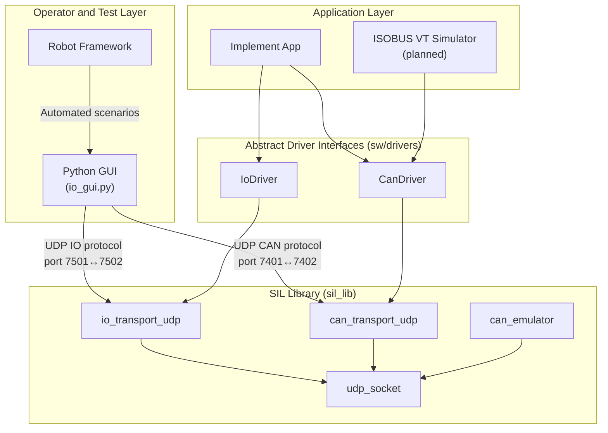
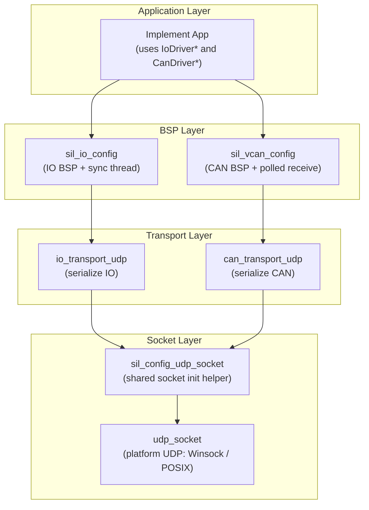

# SIL Library — Software Design Document

---

## Table of Contents

1. [Purpose](#1-purpose)
2. [Scope](#2-scope)
3. [Acronyms and Abbreviations](#3-acronyms-and-abbreviations)
4. [References](#4-references)
5. [System Overview](#5-system-overview)
6. [Architectural Principles](#6-architectural-principles)
7. [Communication Model](#7-communication-model)
8. [Architecture](#8-architecture)
9. [Module Summary](#9-module-summary)
10. [Build Integration](#10-build-integration)
11. [Platform Support](#11-platform-support)
12. [Verification](#12-verification)
13. [Component SDD Plan](#13-component-sdd-plan)
14. [Roadmap](#14-roadmap)
15. [Future Extensions](#15-future-extensions)

**Appendices**

- [Appendix A: Benefits of the SIL System](#appendix-a-benefits-of-the-sil-system)
- [Appendix B: Agricultural Implement Background](#appendix-b-agricultural-implement-background)

---

## 1. Purpose

The SIL library (`sil_lib`) is the core platform layer of a Software-in-the-Loop
environment for developing and validating agricultural implement applications.

It bridges abstract application-facing driver interfaces (`IoDriver`, `CanDriver`) to
UDP-based virtual transports, allowing embedded C applications to run on a Windows
(or Linux) host without modification to their driver API usage.

The platform enables:

- Interactive operation by a human user through a Python GUI
- Automated operation by Robot Framework system tests
- Virtual ISOBUS communication with a Virtual Terminal simulator
- Direct IO control through a binary UDP protocol

This library is designed to be distributed as a binary artifact with public headers.

## 2. Scope

### In Scope

- UDP socket primitives (bind, send, receive, timeout, close)
- Virtual IO transport over UDP with binary wire protocol
- Virtual CAN transport over UDP with binary wire protocol
- In-memory virtual CAN bus emulator with arbitration
- IO BSP configuration with background sync thread
- CAN BSP configuration with polled receive
- Shared socket initialization helper
- Platform-level architecture and boundaries
- Communication paths (ISOBUS/CAN path and direct IO path)
- SOLID-oriented module design strategy

### Out of Scope

- Application logic or pin semantics (see `SDD_implement.md`)
- Abstract driver interfaces (`IoDriver`, `CanDriver`) — those live in `sw/drivers/`
- ISOBUS protocol services (planned)
- Real hardware CAN or IO backends
- VT object-pool content definition
- GUI implementation details (see `tools/UM_io_gui.md`)

## 3. Acronyms and Abbreviations

| Acronym | Expansion | Notes |
|---------|-----------|-------|
| **BSP** | Board Support Package | Platform-specific initialization layer |
| **CAN** | Controller Area Network | ISO 11898 physical/data-link bus standard |
| **CI** | Continuous Integration | Automated build and test pipeline |
| **DIP** | Dependency Inversion Principle | One of the SOLID principles |
| **GUI** | Graphical User Interface | |
| **HIL** | Hardware-in-the-Loop | Test environment using real ECU hardware |
| **HMI** | Human-Machine Interface | Operator interaction panel |
| **IO** | Input/Output | Physical or simulated signals |
| **ISOBUS** | ISO 11783 | CAN-based networking standard for agricultural machinery |
| **ISP** | Interface Segregation Principle | One of the SOLID principles |
| **LSP** | Liskov Substitution Principle | One of the SOLID principles |
| **OCP** | Open/Closed Principle | One of the SOLID principles |
| **PGN** | Parameter Group Number | ISOBUS/J1939 message identifier field |
| **RF** | Robot Framework | Open-source keyword-driven test automation framework |
| **SDD** | Software Design Document | This document |
| **SIL** | Software-in-the-Loop | Test environment using software models only, no hardware |
| **SOLID** | SRP, OCP, LSP, ISP, DIP | Five object-oriented design principles (Robert C. Martin) |
| **SRP** | Single Responsibility Principle | One of the SOLID principles |
| **UDP** | User Datagram Protocol | Connectionless network transport layer |
| **VT** | Virtual Terminal | ISOBUS operator interface device (ISO 11783-6) |

## 4. References

| ID | Reference | Relevance |
|----|-----------|----------|
| [1] | ISO 11783 (ISOBUS) | Governing standard for all ISOBUS communication |
| [2] | ISO 11783-6 — Virtual Terminal | VT protocol and object-pool upload |
| [3] | SAE J1939 | Basis for ISOBUS transport and addressing |
| [4] | CAN 2.0B — Robert Bosch GmbH | CAN frame format |
| [5] | Robert C. Martin — *Clean Code* | SOLID principles foundation |
| [6] | Robert C. Martin — *Clean Architecture* | Layered architecture strategy |

## 5. System Overview

The SIL system has two complementary interaction paths:

- **ISOBUS/CAN path**: Implement app communicates with a Virtual Terminal simulator through
  the CAN driver and virtual CAN transport (or emulator).
- **Direct IO path**: Python GUI (and Robot Framework) writes/reads implement IO over a
  defined binary UDP protocol.



## 6. Architectural Principles

The SIL library follows SOLID principles to keep the architecture extensible and testable.

### 6.1 Single Responsibility

Each module has one reason to change:

| Module | Responsibility |
|--------|---------------|
| `udp_socket` | Platform UDP primitives |
| `io_transport_udp` | IO buffer serialization |
| `can_transport_udp` | CAN frame serialization |
| `can_emulator` | Virtual bus arbitration/routing |
| `sil_io_config` | IO BSP wiring and sync thread lifecycle |
| `sil_vcan_config` | CAN BSP wiring |

### 6.2 Open/Closed

Applications and tests depend on stable driver interfaces (`IoDriver`, `CanDriver`).
Transport implementations can be swapped (UDP → real CAN hardware) without changing
application code.

### 6.3 Liskov Substitution and Interface Segregation

Driver interfaces are narrow and role-specific. Any implementation that fills in the
function pointers correctly is a valid substitute — enabling mocks in unit tests and
platform swaps at init time.

### 6.4 Dependency Inversion

Applications depend on abstractions (`IoDriver *`, `CanDriver *`), never on concrete
transport or socket internals. The BSP modules (`sil_io_config`, `sil_vcan_config`)
are the only place where concrete wiring happens.

## 7. Communication Model

### 7.1 Direct IO UDP Protocol

The Python GUI communicates with the implement app over UDP using a compact binary protocol.

| Offset | Size | Content |
|--------|------|---------|
| 0–1 | 2 | Magic: `'I'`, `'O'` |
| 2 | 1 | Protocol version (1) |
| 3 | 1 | Digital pin count |
| 4 | 1 | Analog pin count |
| 5 | 1 | Reserved (0) |
| 6.. | 1 × digital count | Digital values (0 or 1) |
| .. | 2 × analog count | Analog values (uint16 LE) |

### 7.2 CAN-over-UDP Protocol

CAN frames are serialized as fixed 13-byte UDP datagrams:

| Offset | Size | Content |
|--------|------|---------|
| 0–3 | 4 | CAN ID (uint32, big-endian) |
| 4 | 1 | DLC (0–8) |
| 5–12 | 8 | Data bytes (padded to 8) |

### 7.3 ISOBUS and VT Flow (planned)

1. Implement app initializes CAN driver and ISOBUS services.
2. Implement uploads VT object pool to VT simulator.
3. VT simulator acknowledges and enters operational exchange.
4. Runtime VT commands/events are exchanged through ISOBUS messages.

## 8. Architecture



### Layering Rules

- **Public API**: `sil_io_config.h`, `sil_vcan_config.h` — applications include only these
- **Private**: transports, socket, emulator — not exposed to application code
- **CMake visibility**: BSP libs link transports and socket as `PRIVATE`; only the
  abstract driver headers (`io_driver.h`, `can_driver.h`) leak through `PUBLIC`

## 9. Module Summary

| Module | Directory | Purpose |
|--------|-----------|---------|
| `udp_socket` | `sil_lib/udp_socket/` | Platform UDP socket (Winsock/POSIX) |
| `sil_config_udp_socket` | `sil_lib/udp_socket/` | Shared init helper (bind + timeout) |
| `io_transport_udp` | `sil_lib/io/io_transport_udp/` | IO buffer ↔ UDP serialization |
| `sil_io_config` | `sil_lib/io/` | IO BSP: wires IoDriver + sync thread |
| `can_transport_udp` | `sil_lib/vcan/can_transport_udp/` | CAN frame ↔ UDP serialization |
| `can_emulator` | `sil_lib/vcan/can_emulator/` | In-memory virtual CAN bus |
| `sil_vcan_config` | `sil_lib/vcan/` | CAN BSP: wires CanDriver |

Detailed design for each subsystem:

| Document | Path |
|----------|------|
| SIL IO | `sil_lib/io/SDD_sil_io.md` |
| SIL vCAN | `sil_lib/vcan/SDD_sil_vcan.md` |
| SIL UDP Socket | `sil_lib/udp_socket/SDD_sil_udp_socket.md` |

## 10. Build Integration

The library is built as a set of static libraries via CMake:

| CMake Target | Source | Public Dependencies |
|--------------|--------|---------------------|
| `udp_socket_lib` | `udp_socket.c` | `ws2_32` (Windows) |
| `sil_config_udp_socket_lib` | `sil_config_udp_socket.c` | `udp_socket_lib` |
| `io_transport_udp_lib` | `io_transport_udp.c` | `udp_socket_lib` |
| `sil_io_config_lib` | `sil_io_config.c` | `io_driver_lib` |
| `can_transport_udp_lib` | `can_transport_udp.c` | `udp_socket_lib`, `can_frame_lib` |
| `sil_vcan_config_lib` | `sil_vcan_config.c` | `can_driver_lib` |

Applications link only `sil_io_config_lib` and/or `sil_vcan_config_lib`.
Transports and socket are pulled in transitively as private dependencies.

## 11. Platform Support

| Platform | Socket Backend | Threading |
|----------|---------------|-----------|
| Windows | Winsock2 (`ws2_32`) | `CreateThread` / `WaitForSingleObject` |
| Linux/POSIX | BSD sockets | `pthread_create` / `pthread_join` |

Platform selection is compile-time via `#ifdef _WIN32`.

## 12. Verification

### 12.1 Unit Tests

All modules have unit tests run via Ceedling:

```powershell
Set-Location test
ruby -S ceedling test:all
```

| Test File | Module |
|-----------|--------|
| `sil_lib/udp_socket/test/test_udp_socket.c` | udp_socket |
| `sil_lib/io/io_transport_udp/test/test_io_transport_udp.c` | io_transport_udp |
| `sil_lib/io/test/test_io.c` | sil_io_config |
| `sil_lib/vcan/can_transport_udp/test/test_can_transport_udp.c` | can_transport_udp |
| `sil_lib/vcan/can_emulator/test/test_can_emulator.c` | can_emulator |

### 12.2 Manual Verification

- Operator drives IO through Python GUI
- Operator observes implement responses and state progression
- Operator verifies CAN connectivity via GUI status indicator

### 12.3 Automated Verification (planned)

Robot Framework scenarios will validate end-to-end behavior:

- IO command to implement via GUI/protocol path
- Implement state transition correctness
- ISOBUS exchange with VT simulator
- Deterministic startup/shutdown with explicit pass/fail observability

## 13. Component SDD Plan

| Document | Path | Status |
|----------|------|--------|
| SIL IO | `sil_lib/io/SDD_sil_io.md` | Current |
| SIL vCAN | `sil_lib/vcan/SDD_sil_vcan.md` | Current |
| SIL UDP Socket | `sil_lib/udp_socket/SDD_sil_udp_socket.md` | Current |
| CAN Driver | `sw/drivers/can_driver/SDD_can_driver.md` | Current |
| CAN Frame | `sw/drivers/can_driver/can_frame/SDD_can_frame.md` | Current |
| IO Driver | `sw/drivers/io/SDD_io_driver.md` | Current |
| Implement App | `sw/apps/implement/SDD_implement.md` | Current |
| IO GUI Manual | `tools/UM_io_gui.md` | Current |
| Unit Testing Manual | `test/UM_testing.md` | Current |
| VT Simulator SDD | — | Planned |
| ISOBUS Services SDD | — | Planned |
| Robot Framework Test Architecture SDD | — | Planned |

## 14. Roadmap

1. ~~Define stable interfaces for core modules~~ (done)
2. ~~Implement minimal implement app with IO and CAN~~ (done)
3. ~~Implement Python GUI with UDP protocol adapter~~ (done)
4. Implement VT simulator integration including object-pool upload handling
5. Implement ISOBUS services module
6. Implement Robot Framework end-to-end test suites
7. Package SIL library as single static archive with public headers

## 15. Future Extensions

- Replace UDP transport with real CAN hardware transport
- Add richer implement behavior and fault handling
- Support additional implement types in the same SIL framework
- Add logging/replay and fault injection for regression testing
- CI pipeline integration with automated SIL test execution

---

## Appendix A: Benefits of the SIL System

### Engineering Benefits

- Faster development feedback by testing communication and IO logic without hardware
- Better modularity due to SOLID separation between driver, transport, and app logic
- Safer refactoring because deterministic tests quickly detect regressions

### Verification Benefits

- Repeatable end-to-end validation with Robot Framework
- Early validation of VT object-pool upload before integration labs
- Improved defect localization by separating IO path from ISOBUS path failures

### Program and Business Benefits

- Reduced integration risk transitioning from SIL to HIL/vehicle/field
- Lower cost of testing by reducing dependence on physical CAN/ISOBUS setups
- Higher release confidence through consistent manual + automated coverage

### Scalability Benefits

- Same architecture supports additional implements with minimal platform changes
- Transport layer can be swapped from UDP to real CAN while preserving tests
- Component-level SDD strategy allows teams to parallelize development

---

## Appendix B: Agricultural Implement Background

In the agricultural world, an **implement** is any piece of machinery attached to,
towed by, or powered by a tractor to perform a specific farming task.

| Implement | Primary Function |
|-----------|-----------------|
| **Baler** | Compresses cut crop material into compact bales |
| **Sprayer** | Distributes liquid chemicals across a field |
| **Planter / Seeder** | Deposits seeds at controlled depth and spacing |
| **Combine Harvester** | Reaps, threshes, and winnows grain crops |
| **Cultivator / Tillage** | Works the soil to prepare seed beds |
| **Fertilizer Spreader** | Distributes granular or liquid fertilizers |

In this project, **implement** refers to any ISOBUS-capable working machine that:

- Communicates with a **Virtual Terminal (VT)** via ISO 11783-6
- Exposes physical **IO signals** (sensors, actuators) that can be driven and monitored
- Operates on a shared **ISOBUS/CAN network** alongside a tractor ECU

The demo application represents a simplified fan controller. The architecture is
intentionally agnostic to the specific implement type.
