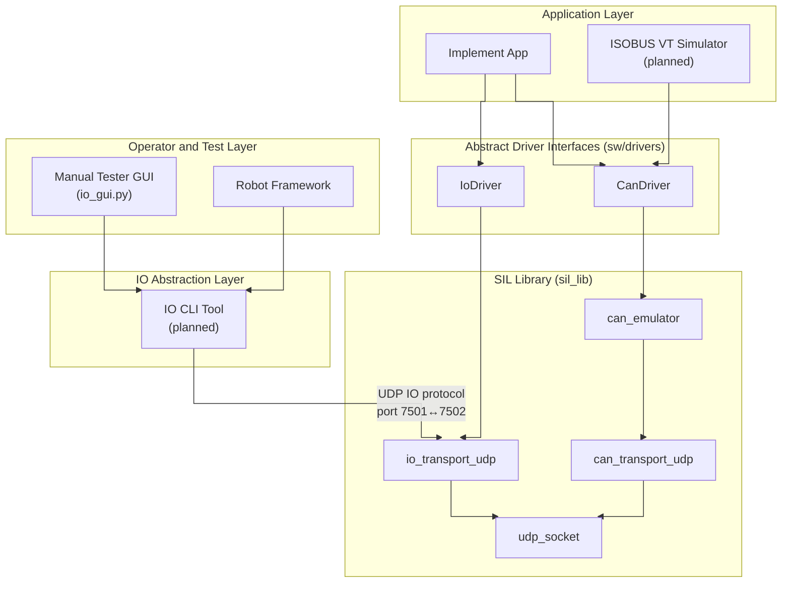
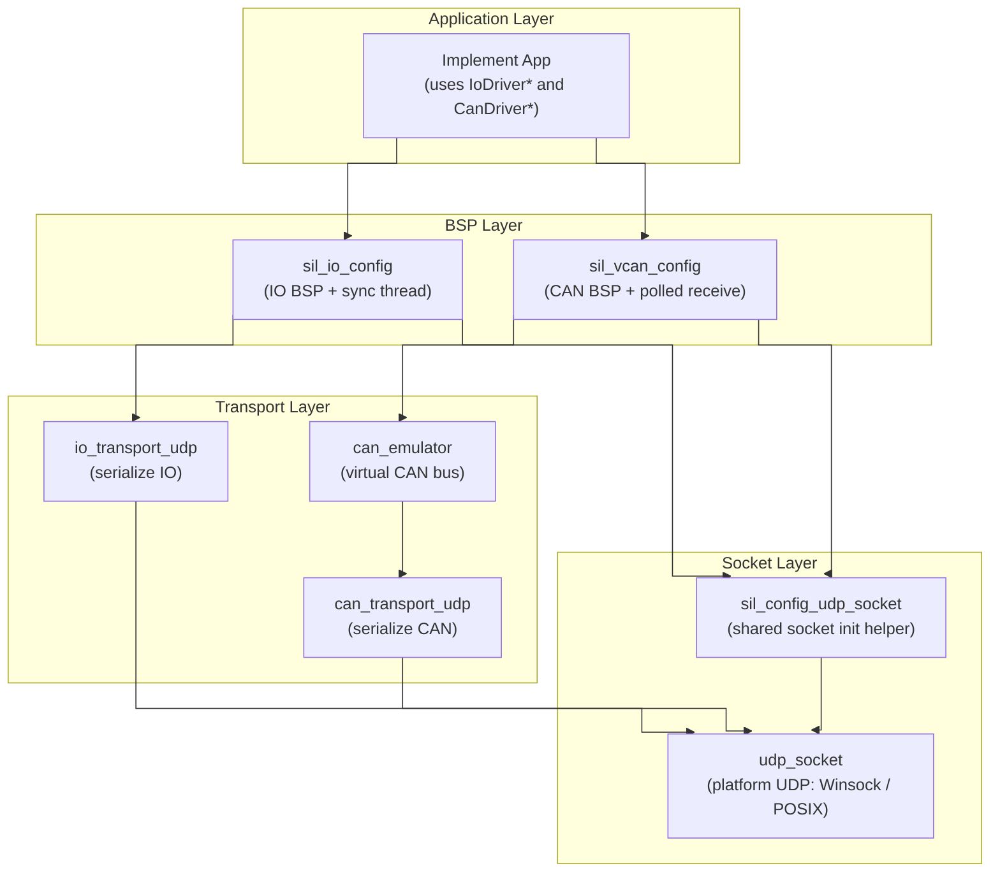
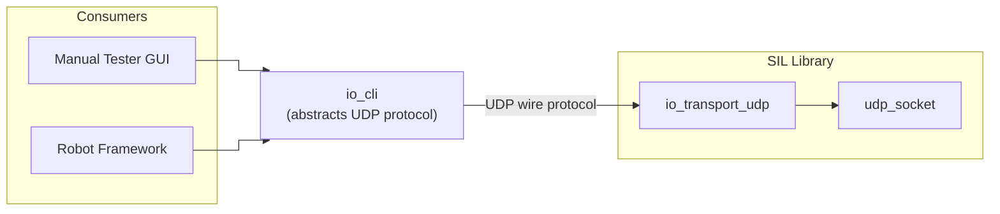

# SIL Library — Software Design Document

---

## Table of Contents

1. [Purpose](#1-purpose)
2. [Scope](#2-scope)
3. [Acronyms and Abbreviations](#3-acronyms-and-abbreviations)
4. [References](#4-references)
5. [System Overview](#5-system-overview)
6. [Architectural Principles](#6-architectural-principles)
7. [Communication Model](#7-communication-model)
8. [Architecture](#8-architecture)
9. [IO CLI Abstraction Layer](#9-io-cli-abstraction-layer)
10. [Module Summary](#10-module-summary)
11. [Build Integration](#11-build-integration)
12. [Platform Support](#12-platform-support)
13. [Verification](#13-verification)
14. [Component SDD Plan](#14-component-sdd-plan)
15. [Roadmap](#15-roadmap)
16. [Future Extensions](#16-future-extensions)

**Appendices**

- [Appendix A: Benefits of the SIL System](#appendix-a-benefits-of-the-sil-system)
- [Appendix B: Agricultural Implement Background](#appendix-b-agricultural-implement-background)

---

## 1. Purpose

The SIL library (`sil_lib`) is the core platform layer of a Software-in-the-Loop
environment for developing and validating agricultural implement applications.

It bridges abstract application-facing driver interfaces (`IoDriver`, `CanDriver`) to
UDP-based virtual transports, allowing embedded C applications to run on a Windows
(or Linux) host without modification to their driver API usage.

The platform enables:

- Interactive operation by a human user through a Manual Tester GUI
- Automated operation by Robot Framework system tests
- Virtual ISOBUS communication with a Virtual Terminal simulator
- Direct IO control through a binary UDP protocol

This library is designed to be distributed as a binary artifact with public headers.

## 2. Scope

### In Scope

- UDP socket primitives (bind, send, receive, timeout, close)
- Virtual IO transport over UDP with binary wire protocol
- Virtual CAN transport over UDP with binary wire protocol
- In-memory virtual CAN bus emulator with arbitration
- IO BSP configuration with background sync thread
- CAN BSP configuration with polled receive
- Shared socket initialization helper
- Platform-level architecture and boundaries
- Communication paths (ISOBUS/CAN path and direct IO path)
- SOLID-oriented module design strategy
- IO CLI abstraction layer for consumer-side IO access (planned)

### Out of Scope

- Application logic or pin semantics (see `SDD_implement.md`)
- Abstract driver interfaces (`IoDriver`, `CanDriver`) — those live in `sw/drivers/`
- ISOBUS protocol services (planned)
- Real hardware CAN or IO backends
- VT object-pool content definition
- GUI implementation details (see `tools/UM_io_gui.md`)

## 3. Acronyms and Abbreviations

| Acronym | Expansion | Notes |
|---------|-----------|-------|
| **BSP** | Board Support Package | Platform-specific initialization layer |
| **CAN** | Controller Area Network | ISO 11898 physical/data-link bus standard |
| **CI** | Continuous Integration | Automated build and test pipeline |
| **DIP** | Dependency Inversion Principle | One of the SOLID principles |
| **CLI** | Command-Line Interface | |
| **GUI** | Graphical User Interface | |
| **HIL** | Hardware-in-the-Loop | Test environment using real ECU hardware |
| **HMI** | Human-Machine Interface | Operator interaction panel |
| **IO** | Input/Output | Physical or simulated signals |
| **ISOBUS** | ISO 11783 | CAN-based networking standard for agricultural machinery |
| **ISP** | Interface Segregation Principle | One of the SOLID principles |
| **LSP** | Liskov Substitution Principle | One of the SOLID principles |
| **OCP** | Open/Closed Principle | One of the SOLID principles |
| **PGN** | Parameter Group Number | ISOBUS/J1939 message identifier field |
| **RF** | Robot Framework | Open-source keyword-driven test automation framework |
| **SDD** | Software Design Document | This document |
| **SIL** | Software-in-the-Loop | Test environment using software models only, no hardware |
| **SOLID** | SRP, OCP, LSP, ISP, DIP | Five object-oriented design principles (Robert C. Martin) |
| **SRP** | Single Responsibility Principle | One of the SOLID principles |
| **UDP** | User Datagram Protocol | Connectionless network transport layer |
| **VT** | Virtual Terminal | ISOBUS operator interface device (ISO 11783-6) |

## 4. References

| ID | Reference | Relevance |
|----|-----------|----------|
| [1] | ISO 11783 (ISOBUS) | Governing standard for all ISOBUS communication |
| [2] | ISO 11783-6 — Virtual Terminal | VT protocol and object-pool upload |
| [3] | SAE J1939 | Basis for ISOBUS transport and addressing |
| [4] | CAN 2.0B — Robert Bosch GmbH | CAN frame format |
| [5] | Robert C. Martin — *Clean Code* | SOLID principles foundation |
| [6] | Robert C. Martin — *Clean Architecture* | Layered architecture strategy |

## 5. System Overview

The SIL system has two complementary interaction paths:

- **ISOBUS/CAN path**: Implement app communicates with a Virtual Terminal simulator through
  the CAN driver and virtual CAN transport (or emulator).
- **Direct IO path**: Consumers (Manual Tester GUI, Robot Framework) read and write implement
  IO through an IO CLI tool that encapsulates the UDP wire protocol.



## 6. Architectural Principles

The SIL library follows SOLID principles to keep the architecture extensible and testable.

### 6.1 Single Responsibility

Each module has one reason to change:

| Module | Responsibility |
|--------|---------------|
| `can_frame` | CAN frame data type and validation |
| `can_driver` | Abstract CAN driver dispatch |
| `io_driver` | Abstract IO driver dispatch |
| `udp_socket` | Platform UDP primitives |
| `sil_config_udp_socket` | Socket initialization helper |
| `io_transport_udp` | IO buffer serialization |
| `can_transport_udp` | CAN frame serialization |
| `can_emulator` | Virtual bus arbitration/routing |
| `sil_io_config` | IO BSP wiring and sync thread lifecycle |
| `sil_vcan_config` | CAN BSP wiring |

### 6.2 Open/Closed

Applications and tests depend on stable driver interfaces (`IoDriver`, `CanDriver`).
Transport implementations can be swapped (UDP → real CAN hardware) without changing
application code.

### 6.3 Liskov Substitution and Interface Segregation

Driver interfaces are narrow and role-specific. Any implementation that fills in the
function pointers correctly is a valid substitute — enabling mocks in unit tests and
platform swaps at init time.

### 6.4 Dependency Inversion

Applications depend on abstractions (`IoDriver *`, `CanDriver *`), never on concrete
transport or socket internals. The BSP modules (`sil_io_config`, `sil_vcan_config`)
are the only place where concrete wiring happens.

## 7. Communication Model

### 7.1 Direct IO UDP Protocol

The Manual Tester GUI communicates with the implement app over UDP using a compact binary protocol.

| Offset | Size | Content |
|--------|------|---------|
| 0–1 | 2 | Magic: `'I'`, `'O'` |
| 2 | 1 | Protocol version (1) |
| 3 | 1 | Digital pin count |
| 4 | 1 | Analog pin count |
| 5 | 1 | Reserved (0) |
| 6.. | 1 × digital count | Digital values (0 or 1) |
| .. | 2 × analog count | Analog values (uint16 LE) |

### 7.2 CAN-over-UDP Protocol

CAN frames are serialized as fixed 13-byte UDP datagrams:

| Offset | Size | Content |
|--------|------|---------|
| 0–3 | 4 | CAN ID (uint32, big-endian) |
| 4 | 1 | DLC (0–8) |
| 5–12 | 8 | Data bytes (padded to 8) |

### 7.3 ISOBUS and VT Flow (planned)

1. Implement app initializes CAN driver and ISOBUS services.
2. Implement uploads VT object pool to VT simulator.
3. VT simulator acknowledges and enters operational exchange.
4. Runtime VT commands/events are exchanged through ISOBUS messages.

## 8. Architecture



### Layering Rules

- **Public API**: `sil_io_config.h`, `sil_vcan_config.h`, `can_driver.h`, `can_frame.h`,
  `io_driver.h`, `sil_lib_version.h` — installed headers for application use
- **Private**: transports, socket, emulator — internal to `sil_lib`, not exposed via headers
- **CMake visibility**: `sil_lib` is a single static library. Transport and socket headers
  are `PRIVATE` include directories; driver and BSP config headers are `PUBLIC`

## 9. IO CLI Abstraction Layer

### 9.1 Problem

Today every consumer of the application's IO — the Manual Tester GUI and future Robot Framework
tests — must implement the binary UDP wire protocol directly. This creates two problems:

1. **Protocol duplication**: Each consumer independently serializes and deserializes the
   IO transport framing (magic bytes, version, pin layout, endianness). Any protocol
   change must be replicated across all consumers.
2. **Tight coupling**: Consumers are coupled to transport-level details (port numbers,
   buffer sizes, timing) that are not part of their core responsibility.

### 9.2 Design Intent

Introduce a single abstract interface to the application's IO that hides the UDP wire
protocol behind a consumer-friendly boundary. The interface will be implemented first as
a **command-line tool** (`io_cli`), then reused by all consumers:

- The **Manual Tester GUI** invokes the CLI as a subprocess instead of managing sockets directly.
- **Robot Framework** keywords call the CLI, eliminating the need for a custom RF library
  that speaks raw UDP.

### 9.3 Responsibilities

| Concern | Owner |
|---------|-------|
| UDP wire protocol (encode/decode) | `io_cli` |
| Connection lifecycle (bind, timeout, close) | `io_cli` |
| Pin semantics and naming | Consumer (GUI, RF) |
| Presentation and visualization | Consumer |

### 9.4 Conceptual Interface

The CLI tool will expose IO operations as simple commands:

| Command | Description |
|---------|-------------|
| `io_cli read digital <pin>` | Read a single digital pin value |
| `io_cli write digital <pin> <value>` | Write a single digital pin |
| `io_cli read analog <pin>` | Read a single analog pin value |
| `io_cli write analog <pin> <value>` | Write a single analog pin |
| `io_cli snapshot` | Read all pin values in one exchange |
| `io_cli monitor` | Continuously print pin state changes |

Output will be machine-parseable (e.g., single-value or JSON) so that both human users
and automated consumers can process it without fragile text scraping.

### 9.5 Architectural Position

The IO CLI sits between consumers and the SIL library, forming an abstraction layer:



### 9.6 Benefits

- **Single protocol owner**: Only the CLI encodes/decodes the wire format; protocol
  changes are isolated to one place.
- **Consumer simplification**: GUI and RF tests become thinner — they delegate IO
  transport to the CLI and focus on their own responsibilities.
- **Incremental adoption**: Existing consumers can migrate one at a time; the raw UDP
  path remains available during transition.
- **Testability**: The CLI itself can be unit-tested against the transport layer,
  and consumers can be tested with a stubbed CLI.

### 9.7 Open Questions

- Should the CLI be a compiled C executable (reusing `sil_lib` directly) or a Python
  wrapper around the protocol?
- Should a long-running daemon mode be supported for consumers that need continuous
  bidirectional IO, or is a request/response model sufficient?
- What is the versioning/compatibility contract between the CLI and the wire protocol?

## 10. Module Summary

| Module | Directory | Purpose |
|--------|-----------|---------|
| `can_frame` | `sil_lib/drivers/` | CAN frame data type and validation |
| `can_driver` | `sil_lib/drivers/` | Abstract CAN driver interface and dispatch |
| `io_driver` | `sil_lib/drivers/` | Abstract IO driver interface and dispatch |
| `udp_socket` | `sil_lib/udp_socket/` | Platform UDP socket (Winsock/POSIX) |
| `sil_config_udp_socket` | `sil_lib/udp_socket/` | Shared init helper (bind + timeout) |
| `io_transport_udp` | `sil_lib/io/io_transport_udp/` | IO buffer ↔ UDP serialization |
| `sil_io_config` | `sil_lib/io/` | IO BSP: wires IoDriver + sync thread |
| `can_transport_udp` | `sil_lib/vcan/can_transport_udp/` | CAN frame ↔ UDP serialization |
| `can_emulator` | `sil_lib/vcan/can_emulator/` | In-memory virtual CAN bus |
| `sil_vcan_config` | `sil_lib/vcan/` | CAN BSP: wires CanDriver |

Detailed design for each subsystem:

| Document | Path |
|----------|------|
| SIL IO | `sil_lib/io/SDD_sil_io.md` |
| SIL vCAN | `sil_lib/vcan/SDD_sil_vcan.md` |
| SIL CAN Emulator | `sil_lib/vcan/can_emulator/SDD_sil_can_emulator.md` |
| SIL UDP Socket | `sil_lib/udp_socket/SDD_sil_udp_socket.md` |

## 11. Build Integration

The library is built as a single static library (`sil_lib`) via CMake, bundling all
modules including driver abstractions:

| CMake Target | Sources | Notes |
|--------------|---------|-------|
| `sil_lib` | `drivers/*.c`, `udp_socket/*.c`, `io/*.c`, `vcan/**/*.c` | Single library with all modules |

Public link dependency: `ws2_32` (Windows only).

The root `CMakeLists.txt` also builds separate application-level targets:

| CMake Target | Source | Dependencies |
|--------------|--------|--------------|
| `can_frame_lib` | `sw/drivers/can_driver/can_frame/can_frame.c` | — |
| `can_driver_lib` | `sw/drivers/can_driver/can_driver.c` | `can_frame_lib` |
| `io_driver_lib` | `sw/drivers/io/io_driver.c` | — |
| `pi_controller_lib` | `sw/modules/pi_controller/pi_controller.c` | — |
| `fan_controller_lib` | `sw/modules/fan_controller/fan_controller.c` | `pi_controller_lib`, `io_driver_lib`, `can_driver_lib` |
| `implement` | `sw/apps/implement/main.c` | `fan_controller_lib`, `sil_lib` |

Applications link `sil_lib` to get the full platform layer including driver interfaces.

## 12. Platform Support

| Platform | Socket Backend | Threading |
|----------|---------------|-----------|
| Windows | Winsock2 (`ws2_32`) | `CreateThread` / `WaitForSingleObject` |
| Linux/POSIX | BSD sockets | `pthread_create` / `pthread_join` |

Platform selection is compile-time via `#ifdef _WIN32`.

## 13. Verification

### 13.1 Unit Tests

All modules have unit tests run via Ceedling:

```powershell
Set-Location test
ruby -S ceedling test:all
```

| Test File | Module |
|-----------|--------|
| `sil_lib/drivers/test/test_can_driver.c` | can_driver |
| `sil_lib/drivers/test/test_io_driver.c` | io_driver |
| `sil_lib/udp_socket/test/test_udp_socket.c` | udp_socket |
| `sil_lib/udp_socket/test/test_sil_config_udp_socket.c` | sil_config_udp_socket |
| `sil_lib/io/io_transport_udp/test/test_io_transport_udp.c` | io_transport_udp |
| `sil_lib/io/test/test_sil_io_config.c` | sil_io_config |
| `sil_lib/vcan/can_transport_udp/test/test_can_transport_udp.c` | can_transport_udp |
| `sil_lib/vcan/can_emulator/test/test_can_emulator.c` | can_emulator |
| `sil_lib/vcan/test/test_sil_vcan_config.c` | sil_vcan_config |

### 13.2 Manual Verification

- Operator drives IO through Manual Tester GUI
- Operator observes implement responses and state progression
- Operator verifies CAN connectivity via GUI status indicator

### 13.3 Automated Verification (planned)

Robot Framework scenarios will validate end-to-end behavior:

- IO command to implement via GUI/protocol path
- Implement state transition correctness
- ISOBUS exchange with VT simulator
- Deterministic startup/shutdown with explicit pass/fail observability

## 14. Component SDD Plan

| Document | Path | Status |
|----------|------|--------|
| SIL IO | `sil_lib/io/SDD_sil_io.md` | Current |
| SIL vCAN | `sil_lib/vcan/SDD_sil_vcan.md` | Current |
| SIL CAN Emulator | `sil_lib/vcan/can_emulator/SDD_sil_can_emulator.md` | Current |
| SIL UDP Socket | `sil_lib/udp_socket/SDD_sil_udp_socket.md` | Current |
| CAN Driver | `sw/drivers/can_driver/SDD_can_driver.md` | Current |
| CAN Frame | `sw/drivers/can_driver/can_frame/SDD_can_frame.md` | Current |
| IO Driver | `sw/drivers/io/SDD_io_driver.md` | Current |
| Implement App | `sw/apps/implement/SDD_implement.md` | Current |
| IO GUI Manual | `tools/UM_io_gui.md` | Current |
| Unit Testing Manual | `test/UM_testing.md` | Current |
| VT Simulator SDD | — | Planned |
| ISOBUS Services SDD | — | Planned |
| IO CLI | — | Planned |
| Robot Framework Test Architecture SDD | — | Planned |

---

## Appendix A: Benefits of the SIL System

### Engineering Benefits

- Faster development feedback by testing communication and IO logic without hardware
- Better modularity due to SOLID separation between driver, transport, and app logic
- Safer refactoring because deterministic tests quickly detect regressions

### Verification Benefits

- Repeatable end-to-end validation with Robot Framework
- Early validation of VT object-pool upload before integration labs
- Improved defect localization by separating IO path from ISOBUS path failures

### Program and Business Benefits

- Reduced integration risk transitioning from SIL to HIL/vehicle/field
- Lower cost of testing by reducing dependence on physical CAN/ISOBUS setups
- Higher release confidence through consistent manual + automated coverage

### Scalability Benefits

- Same architecture supports additional implements with minimal platform changes
- Transport layer can be swapped from UDP to real CAN while preserving tests
- Component-level SDD strategy allows teams to parallelize development

---

## Appendix B: Agricultural Implement Background

In the agricultural world, an **implement** is any piece of machinery attached to,
towed by, or powered by a tractor to perform a specific farming task.

| Implement | Primary Function |
|-----------|-----------------|
| **Baler** | Compresses cut crop material into compact bales |
| **Sprayer** | Distributes liquid chemicals across a field |
| **Planter / Seeder** | Deposits seeds at controlled depth and spacing |
| **Combine Harvester** | Reaps, threshes, and winnows grain crops |
| **Cultivator / Tillage** | Works the soil to prepare seed beds |
| **Fertilizer Spreader** | Distributes granular or liquid fertilizers |

In this project, **implement** refers to any ISOBUS-capable working machine that:

- Communicates with a **Virtual Terminal (VT)** via ISO 11783-6
- Exposes physical **IO signals** (sensors, actuators) that can be driven and monitored
- Operates on a shared **ISOBUS/CAN network** alongside a tractor ECU

The demo application represents a simplified fan controller. The architecture is
intentionally agnostic to the specific implement type.
