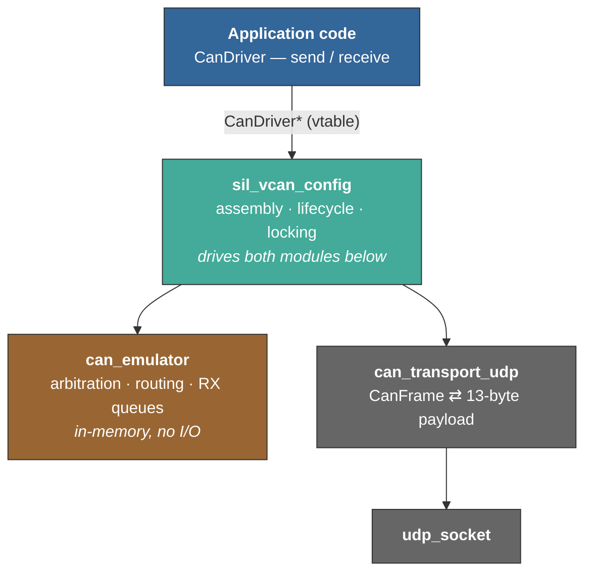
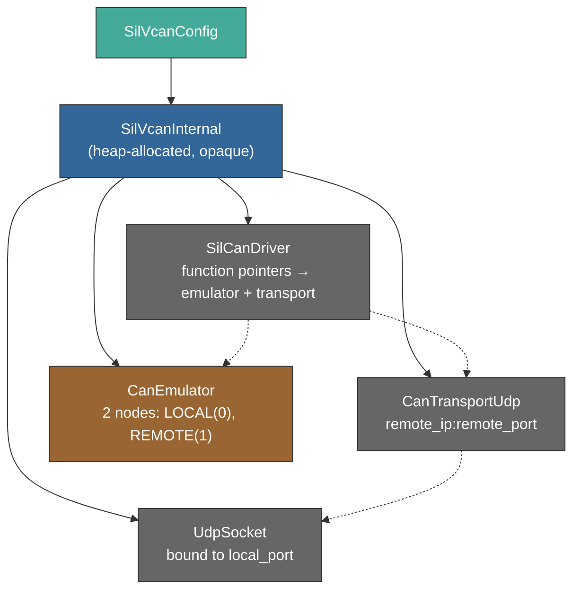
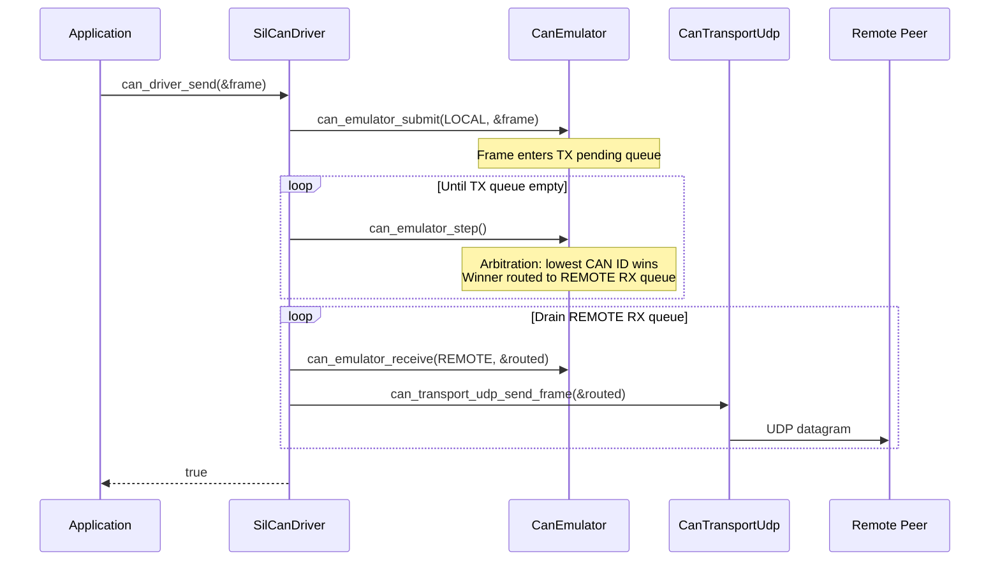
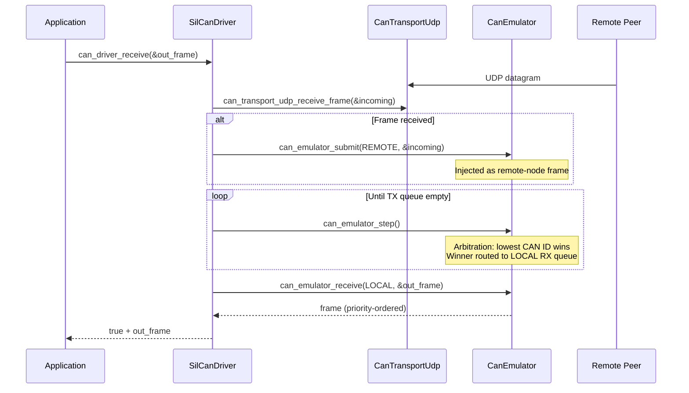
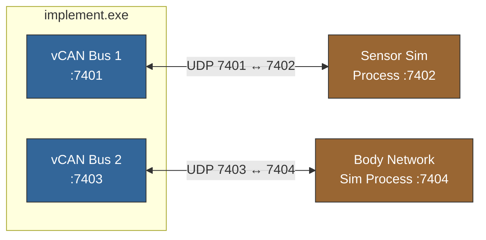
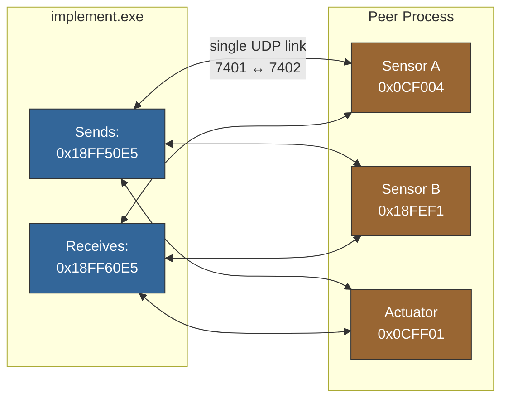
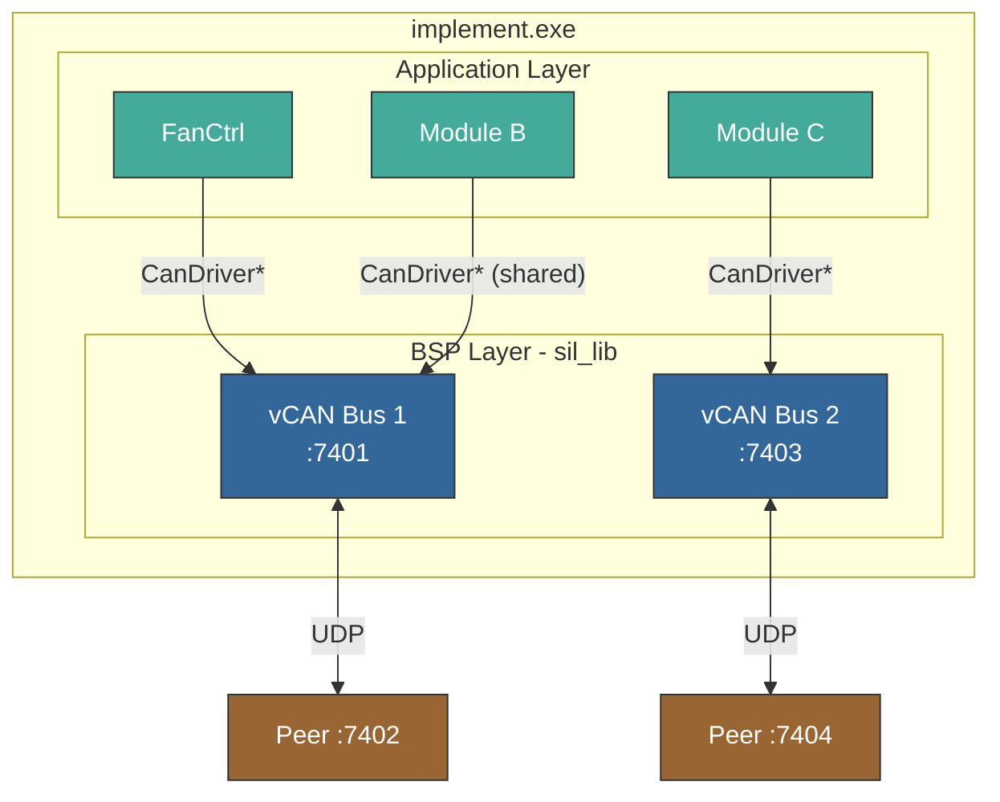
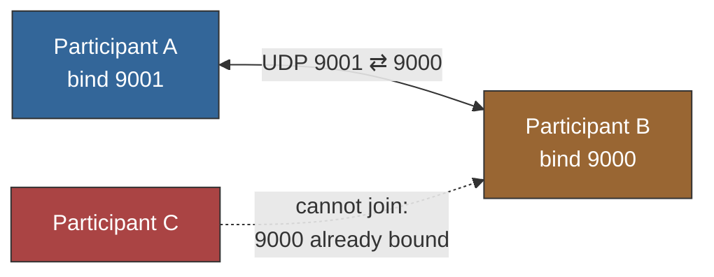
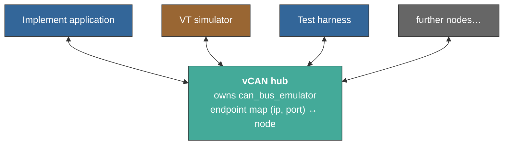

# SIL vCAN — Software Design Document

## 1. Purpose

The SIL vCAN subsystem replaces physical CAN hardware with a software stack
that provides realistic CAN bus behavior for simulation. It lets application
code use the standard `CanDriver` interface without knowing whether it runs
on real hardware or a simulated environment.

The subsystem is assembled from three collaborating modules:



Note that `can_emulator` and `can_transport_udp` are **peers**, not a pipeline:
neither calls the other. `sil_vcan_config` owns both and sequences them inside
its `send` and `receive` callbacks. This is what keeps `can_emulator` free of
I/O and independently testable.

## 2. Components

| Component | File(s) | Responsibility |
|-----------|---------|----------------|
| `sil_vcan_config` | `sil_vcan_config.h`, `.c` | BSP entry point: init, driver access, teardown |
| `can_emulator` | `can_emulator/can_emulator.h`, `.c` | In-memory virtual CAN bus with arbitration |
| `can_transport_udp` | `can_transport_udp/can_transport_udp.h`, `.c` | CAN frame ↔ UDP serialization |

## 3. Architecture

### 3.1 Internal Ownership

Each `SilVcanConfig` instance owns a self-contained stack:



### 3.2 Emulator Nodes

The emulator registers two logical nodes per bus instance:

| Node | ID | Role |
|------|----|------|
| `LOCAL`  | 0 | The application's CAN controller |
| `REMOTE` | 1 | Represents the peer on the other end of the UDP link |

When LOCAL sends, frames are routed to REMOTE's RX queue (then forwarded over
UDP). When UDP frames arrive, they are submitted as REMOTE and routed to
LOCAL's RX queue (then dequeued by the application).

### 3.3 Driver Extension Pattern

`SilCanDriver` embeds `CanDriver` as its first member and adds pointers to the
`CanEmulator` and `CanTransportUdp` instances. The `send` and `receive`
callbacks route frames through the emulator for arbitration before hitting the
UDP transport.

### 3.4 Receive Model

Unlike the IO subsystem, CAN uses **polled receive** — the application calls
`can_driver_receive()` in its main loop. No background thread is used.
The socket timeout controls how long each receive call blocks.

### 3.5 Thread Safety

Each `SilVcanInternal` instance contains a platform mutex (CRITICAL_SECTION on
Windows, `pthread_mutex_t` on POSIX). The locking discipline ensures:

- **Socket I/O is never performed inside the lock.** `sendto` and `recvfrom`
  run outside the critical section to avoid blocking other threads.
- **Emulator state is always accessed under the lock.** Submit, step, and
  receive operations on the `CanEmulator` are serialized.

This allows safe concurrent calls to `can_driver_send()` and
`can_driver_receive()` from different threads on the same bus instance.

### 3.6 Send Flow



### 3.7 Receive Flow



Only **one** UDP datagram is pulled per call so that the caller sees each
frame individually — important for ISOBUS TP/ETP flow control where timely
processing of every CTS / DPO matters. If multiple frames are pending in the
socket buffer, they are delivered across successive `can_driver_receive()` calls
in CAN arbitration order.

## 4. Usage

### 4.1 Initialization (BSP Phase)

Each virtual CAN bus is created by initializing one `SilVcanConfig` instance.
This allocates and wires together the internal components:

```c
#include "sil_vcan_config.h"

SilVcanConfig sil_can = {0};

SilVcanConfigParams params = {
    .local_port      = 7401,
    .remote_ip       = "127.0.0.1",
    .remote_port     = 7402,
    .timeout_ms      = 1,    /* non-blocking poll */
    .max_pending_tx  = 16,
    .max_rx_queue    = 16,
};

sil_vcan_config_init(&sil_can, &params);
```

Then retrieve the abstract driver handle:

```c
CanDriver *can = sil_vcan_config_get_driver(&sil_can);
```

The application uses only `can_driver_send()` and `can_driver_receive()` from
this point on. It never touches the emulator or transport directly.

### 4.2 Teardown

```c
can_driver_close(can);
sil_vcan_config_deinit(&sil_can);
```

This closes the UDP socket and frees all internal state.

### 4.3 Multiple CAN Buses

Each `SilVcanConfig` is a fully independent bus. To simulate an ECU with
multiple CAN controllers, create one instance per bus:

```c
/*  BUS 1 — engine sensors  */
SilVcanConfig sil_can1 = {0};
SilVcanConfigParams bus1_params = {
    .local_port      = 7401,
    .remote_ip       = "127.0.0.1",
    .remote_port     = 7402,
    .timeout_ms      = 1,
    .max_pending_tx  = 16,
    .max_rx_queue    = 16,
};
sil_vcan_config_init(&sil_can1, &bus1_params);

/*  BUS 2 — body network  */
SilVcanConfig sil_can2 = {0};
SilVcanConfigParams bus2_params = {
    .local_port      = 7403,
    .remote_ip       = "127.0.0.1",
    .remote_port     = 7404,
    .timeout_ms      = 1,
    .max_pending_tx  = 16,
    .max_rx_queue    = 16,
};
sil_vcan_config_init(&sil_can2, &bus2_params);

CanDriver *can_engine = sil_vcan_config_get_driver(&sil_can1);
CanDriver *can_body   = sil_vcan_config_get_driver(&sil_can2);
```

Each bus is fully isolated — separate socket, separate emulator, separate
driver. Application modules receive a `CanDriver*` and don't know which bus
they're on.



### 4.4 Multiple Nodes on One Bus

Multiple CAN nodes on the same bus do **not** require multiple UDP links.
On a real CAN bus, all nodes share the wire and are distinguished by CAN IDs.

The peer process simulates as many nodes as needed. Each simulated sensor or
actuator uses a different CAN ID:



The emulator provides CAN arbitration: if Sensor A and Sensor B both send
frames, the one with the lower CAN ID is delivered to the application first.

> **Boundary.** This covers multiple *logical* nodes hosted inside a single
> peer process, which is often all that is needed. It does not allow several
> independently built **processes** to share one bus — the UDP link has exactly
> one remote endpoint. See section 12 for the planned hub that removes this
> restriction.

### 4.5 Full Topology Example



Multiple modules can share the same `CanDriver*` pointer if they are on the
same bus. Each bus needs its own `SilVcanConfig` with a unique port pair.

## 5. Wire Protocol

CAN frames are serialized as fixed 13-byte UDP datagrams:

| Offset | Size | Content |
|--------|------|---------|
| 0–3 | 4 | CAN ID (uint32, big-endian) |
| 4 | 1 | DLC (0–8) |
| 5–12 | 8 | Data bytes (padded to 8) |

### Validation

- Payload must be exactly `CAN_TRANSPORT_UDP_WIRE_SIZE` (13) bytes
- Decoded frame must pass `can_frame_is_valid()` (DLC ≤ 8)

## 6. CAN Emulator

The `can_emulator` module provides a deterministic in-memory virtual CAN bus
used internally by `sil_vcan_config` to model CAN controller behavior.
All internal arrays are dynamically allocated at init time — there are no
compile-time size limits.

See [SDD_sil_can_emulator.md](can_emulator/SDD_sil_can_emulator.md) for full
design details.

The vCAN config layer creates the emulator with 2 nodes (LOCAL and REMOTE).
The TX and RX queue depths are caller-configurable via
`max_pending_tx` and `max_rx_queue` in `SilVcanConfigParams`.

## 7. Configuration Reference

### SilVcanConfigParams

| Field | Type | Description |
|-------|------|-------------|
| `local_port` | `uint16_t` | UDP port to bind locally |
| `remote_ip` | `const char*` | Peer IPv4 address (e.g. `"127.0.0.1"`) |
| `remote_port` | `uint16_t` | Peer UDP port |
| `timeout_ms` | `uint32_t` | Socket receive timeout; use `1` for non-blocking poll |
| `max_pending_tx` | `size_t` | Maximum pending TX frames awaiting arbitration |
| `max_rx_queue` | `size_t` | Maximum receive queue depth per emulator node |

## 8. API Reference

### Public API (`sil_vcan_config.h`)

| Function | Description |
|----------|-------------|
| `sil_vcan_config_init()` | Opens socket, inits transport and emulator, wires driver |
| `sil_vcan_config_get_driver()` | Returns `CanDriver *` with wired function pointers |
| `sil_vcan_config_deinit()` | Closes socket, frees memory |

### Application-level API (`can_driver.h`)

| Function | Description |
|----------|-------------|
| `can_driver_send()` | Submit frame through emulator → UDP |
| `can_driver_receive()` | Pull UDP → emulator arbitration → dequeue |
| `can_driver_close()` | Mark driver as uninitialized |

### Transport API (internal)

| Function | Description |
|----------|-------------|
| `can_transport_udp_init()` | Bind socket to transport with remote endpoint |
| `can_transport_udp_encode()` | `CanFrame` → 13-byte payload |
| `can_transport_udp_decode()` | 13-byte payload → `CanFrame` |
| `can_transport_udp_send_frame()` | Encode + `sendto` |
| `can_transport_udp_receive_frame()` | `recvfrom` + decode |

### Emulator API (internal)

| Function | Description |
|----------|-------------|
| `can_emulator_init(emu, config)` | Allocate and initialize with given capacity |
| `can_emulator_deinit(emu)` | Free all resources |
| `can_emulator_register_node()` | Add a node to the virtual bus |
| `can_emulator_submit()` | Enqueue a frame for arbitration |
| `can_emulator_step()` | Arbitrate + route one winning frame to all other nodes |
| `can_emulator_receive()` | Pop one frame from a node's receive queue |
| `can_emulator_pending_tx_count()` | Query pending transmit count |

## 9. File Structure

| File | Role |
|------|------|
| `sil_lib/vcan/sil_vcan_config.h` | Public API: types, init, get_driver, deinit |
| `sil_lib/vcan/sil_vcan_config.c` | BSP implementation: driver wiring, cleanup |
| `sil_lib/vcan/can_transport_udp/can_transport_udp.h` | Transport API (internal) |
| `sil_lib/vcan/can_transport_udp/can_transport_udp.c` | Transport implementation |
| `sil_lib/vcan/can_transport_udp/test/test_can_transport_udp.c` | Transport unit tests |
| `sil_lib/vcan/can_emulator/can_emulator.h` | Emulator API (internal) |
| `sil_lib/vcan/can_emulator/can_emulator.c` | Emulator implementation |
| `sil_lib/vcan/can_emulator/SDD_sil_can_emulator.md` | Emulator design document |
| `sil_lib/vcan/can_emulator/test/test_can_emulator.c` | Emulator unit tests |

## 10. Dependencies

| Dependency | Visibility | Purpose |
|------------|------------|---------|
| `can_driver` | Public | Abstract `CanDriver` type returned to application |
| `can_frame` | Public (transitive) | Shared `CanFrame` type |
| `can_emulator` | Private | In-memory CAN bus with arbitration |
| `can_transport_udp` | Private | CAN frame serialization over UDP |
| `sil_config_udp_socket` | Private | Shared socket init helper |
| `udp_socket` | Private (transitive) | Platform UDP primitives |

## 11. Verification

```powershell
Set-Location test
ruby -S ceedling test:can_transport_udp
ruby -S ceedling test:can_emulator
```

## 12. Target Architecture — Shared Bus via a Hub

> **Status: planned.** Nothing in this section is implemented yet. Sections
> 1–11 describe the code as it exists today.

### 12.1 The present limitation

`can_transport_udp_send_frame()` transmits to a **single** configured
`remote_ip:remote_port`, and each participant binds one local port. The result
is a point-to-point link — a *cable*, not a *bus*:



Exactly two processes can participate. A third has nowhere to attach, because
the medium has no concept of more than one peer. Section 4.4 describes running
several *logical* nodes inside one peer process, which remains valid and is
often sufficient — but it cannot place independently built executables (an
implement application, a VT simulator, a test harness) on one shared bus.

### 12.2 Target topology

A hub process owns the medium. Every participant sends to the hub, and the hub
replicates each frame to all *other* participants — physically a star,
logically a bus. This is the same pattern used by SocketCAN's `vcan` and by
commercial virtual bus tooling.



Centralising the medium is deliberate: arbitration, frame timing and bandwidth
are properties **of the bus**. Distributing them across peers would require
every node to agree on ordering, and fidelity would degrade. One owner keeps
them correct and in one place.

### 12.3 Relationship to the controller / bus split

This topology is the natural consequence of the module separation described in
`can_emulator/SDD_sil_can_emulator.md` section 9:

| Element | Owner | Instances |
|---------|-------|-----------|
| `can_emulator` (controller) | each participant process | one per node |
| bus connection (transceiver) | each participant process | one per node |
| `can_bus_emulator` (medium) | the hub process | one per bus |

`sil_vcan_config` keeps its present role — assembling a stack and returning a
`CanDriver*` — but assembles *controller + bus connection* rather than
*emulator + transport*. Application code and the `CanDriver` interface are
unaffected.

### 12.4 Compatibility

The hub should bind the port that participants already transmit to, and reply
to each participant's observed source address. A participant whose remote port
already points at the hub then joins **without recompilation**; only components
that currently *bind* the hub's port need their configuration made adjustable.

Retaining the existing point-to-point mode is recommended during migration, so
current two-process setups keep working while the hub is introduced.

### 12.5 Risk — transport protocol timing

Section 3.7 documents that exactly one datagram is pulled per
`can_driver_receive()` call, because ISOBUS TP/ETP flow control depends on
every CTS/DPO being processed promptly. A hub inserts an additional network
hop, and any bus-cycle batching adds further delay.

Mitigation: make the bus cycle length configurable and **default it to zero**
(arbitrate only what is genuinely pending), enabling batching only for
deliberate loaded-bus tests. A transport-protocol regression test against a
real VT must be part of the acceptance criteria for the hub.
