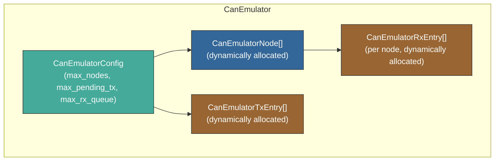
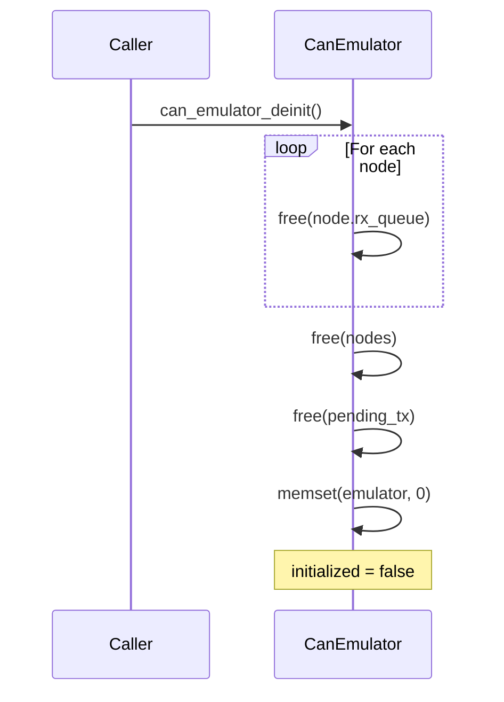
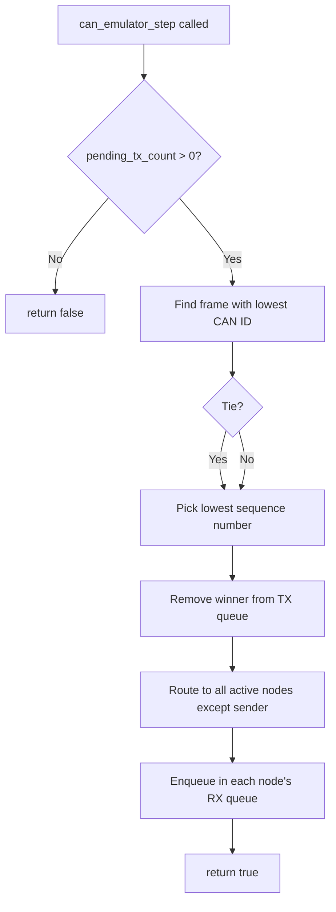
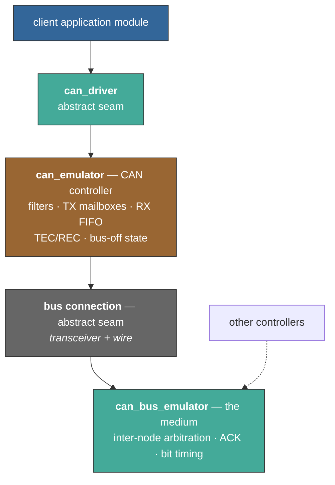

# CAN Emulator — Software Design Document

## 1. Purpose

The CAN emulator provides a deterministic in-memory model of CAN bus behavior
for SIL simulation — TX arbitration, broadcast routing, and per-node RX
queuing — so that applications experience realistic CAN semantics without
physical hardware.

The module performs **no I/O**. It is driven entirely through its API by a
caller that owns the transport. This keeps CAN semantics independent of how
frames reach other processes, and makes the module fully unit-testable without
a network.

> **Scope note — what this module models today.**
> Despite the name, the current implementation models the **bus** (the shared
> medium): it registers several nodes, arbitrates between them, and routes each
> winning frame to every node except the sender.
>
> It does **not** model a microcontroller's **CAN controller peripheral**. A
> real controller sees only its own transmissions and whatever the wire
> delivers to it; it never routes frames between other nodes. Acceptance
> filtering, TEC/REC error counters, the error-active → error-passive →
> bus-off state machine, and bit timing all live in the controller, and none of
> them exist here.
>
> Section 9 describes the planned separation of these two concerns.

## 2. Architecture



All internal arrays are dynamically allocated at init time based on the
`CanEmulatorConfig` provided by the caller. No compile-time size limits exist.

## 3. Dynamic Resource Management

### 3.1 Initialization

`can_emulator_init()` takes a `CanEmulatorConfig` and allocates:

| Resource | Count | Element type |
|----------|-------|-------------|
| Nodes table | `max_nodes` | `CanEmulatorNode` |
| TX pending queue | `max_pending_tx` | `CanEmulatorTxEntry` |
| RX queue per node | `max_nodes × max_rx_queue` | `CanEmulatorRxEntry` |

If any allocation fails, all previously allocated memory is freed and the
function returns `false`. The emulator is not left in a partial state.

### 3.2 Deinitialization

`can_emulator_deinit()` frees all resources in reverse order:



After deinit, the emulator struct is zeroed and safe to reinitialize.

### 3.3 Initialization Safety

All functions check `emulator->initialized` before operating. An uninitialized
or deinitialized emulator rejects all operations gracefully (returns `false`
or `0`).

## 4. Arbitration



- **Priority**: Lowest CAN ID wins (matches real CAN bus CSMA/CD+AMP)
- **Tie-break**: Submission order via monotonic sequence counter
- **Routing**: Broadcast to all nodes except the sender
- **Stepping**: One frame per `can_emulator_step()` call for deterministic control

> Arbitration *between* nodes and broadcast routing are properties of the bus,
> not of a CAN controller. Both are slated to move to `can_bus_emulator`; see
> section 9.4 for the resulting two-level arbitration model.

## 5. Configuration

```c
CanEmulatorConfig config = {
    .max_nodes      = 4,    /* number of bus participants */
    .max_pending_tx = 32,   /* TX buffer depth */
    .max_rx_queue   = 16,   /* RX FIFO depth per node */
};
```

Typical sizing guidelines:

| Use case | max_nodes | max_pending_tx | max_rx_queue |
|----------|-----------|----------------|--------------|
| Point-to-point (vcan_config) | 2 | 16 | 16 |
| Small network | 4–8 | 32 | 32 |
| Full vehicle bus | 16 | 64 | 64 |

## 6. API Reference

| Function | Description |
|----------|-------------|
| `can_emulator_init(emu, config)` | Allocate and initialize with given capacity |
| `can_emulator_deinit(emu)` | Free all resources |
| `can_emulator_register_node(emu, id)` | Add a node to the virtual bus |
| `can_emulator_submit(emu, sender, frame)` | Enqueue a frame for arbitration |
| `can_emulator_step(emu)` | Arbitrate and route one winning frame |
| `can_emulator_receive(emu, receiver, frame, sender)` | Dequeue one frame from a node's RX queue |
| `can_emulator_pending_tx_count(emu)` | Query pending TX queue depth |

## 7. File Structure

| File | Role |
|------|------|
| `can_emulator/can_emulator.h` | Public API and types |
| `can_emulator/can_emulator.c` | Implementation |
| `can_emulator/test/test_can_emulator.c` | Unit tests |

## 8. Verification

```powershell
Set-Location test
ruby -S ceedling test:can_emulator
```

## 9. Target Architecture — Controller / Bus Separation

> **Status: planned.** Nothing in this section is implemented yet. Sections 1–8
> describe the code as it exists today.

### 9.1 Motivation

Two independent observations drive this change.

**The application already asks controller-level questions that SIL cannot
answer.** The PALIF CAN interface used by consuming projects exposes
`CanIf_BusOff()`, `CanIf_GetErrorInfo()` (seven overflow/error counters),
`CanIf_GetTxBufSpace()` and `CanIf_TxFramePrio()` with high/low priority
queues. A hardware backend answers these truthfully. The SIL backend cannot,
because none of that state is modelled — so it reports "no bus-off", "zero
errors", "infinite buffer space" and ignores priority. Any application logic
that reacts to bus-off, TX backpressure or overflow diagnostics therefore takes
the happy path unconditionally and **cannot be exercised in simulation**.

**Controller behavior and medium behavior are different things.** Merging them
into one module means neither can be modelled properly, and it prevents more
than one process from sharing a bus.

### 9.2 Responsibility split

| Concern | Controller (one per node) | Bus (one per medium) | Today |
|---------|:-------------------------:|:--------------------:|-------|
| TX mailbox selection among **own** frames | ✅ | | partial |
| Acceptance filtering (masks / filter banks) | ✅ | | missing |
| RX FIFO + overrun counters | ✅ | | partial |
| TEC / REC counters | ✅ | | missing |
| Error-active → passive → bus-off state machine | ✅ | | missing |
| Bit timing (bitrate, sample point) | ✅ | | missing |
| Auto-retransmission, one-shot, silent/loopback | ✅ | | missing |
| Arbitration **between** nodes | | ✅ | present |
| Frame duration / bus bandwidth | | ✅ | missing |
| ACK slot | | ✅ | missing |
| Propagation to all other nodes | | ✅ | present |

### 9.3 Layering

The target maps one-to-one onto real hardware, which is the primary evidence
that the decomposition is correct:

| Real system | SIL equivalent |
|-------------|----------------|
| Application | client module |
| CAN driver software | `can_driver` |
| CAN controller peripheral | `can_emulator` |
| Transceiver + CAN_H / CAN_L wiring | bus connection (e.g. `can_transport_udp`) |
| The bus / medium | `can_bus_emulator` *(new)* |
| Other ECUs on the wire | other participants |



### 9.4 Two-level arbitration

Splitting the modules makes arbitration two-level, as it is in reality:

1. The **controller** selects the highest-priority frame among *its own*
   pending mailboxes and presents a single candidate to the bus.
2. The **bus** selects the lowest ID among the candidates presented by *all*
   controllers, delivers it to every other node, and leaves the losers pending
   at their controllers to retry on the next cycle.

Step 2's retry is real CAN behavior: a node that loses arbitration
retransmits automatically. The present `find_best_tx_index()` collapses both
levels into a single cross-node sort, which is only adequate because
`sil_vcan_config` registers exactly two nodes and never produces genuine
contention.

### 9.5 The bus connection seam

`can_driver` is an abstract interface at the top of the stack, letting the
application run against real hardware or SIL unchanged. The controller-to-bus
boundary should get the same treatment, using the same
embed-as-first-member pattern, which yields two implementations:

- **local** — controller wired directly to an in-memory bus in the same
  process. No sockets, so controller and bus remain unit-testable together
  under Ceedling, and single-process multi-node tests become trivial.
- **udp** — the existing `can_transport_udp`, remoting the seam to a hub
  process that owns the bus.

Under this model the UDP transport is not a layer in its own right; it is one
implementation of the wire — which is precisely what a transceiver is.

### 9.6 API impact

| Change | Reason |
|--------|--------|
| Add `can_emulator_unregister_node()` | No unregister exists; a bus with dynamic membership cannot free a slot |
| Add bit rate to `CanEmulatorConfig` | Frame duration and bus load are hardware properties |
| Move cross-node routing out of `can_emulator_step()` | Belongs to the medium, not the peripheral |
| Add filter configuration | Must default to accept-all to preserve current behavior |

Scope caution: model only what the consuming driver interface can observe —
the PALIF counters, bus-off, TX buffer space and priority. Full ISO 11898-1
fault confinement (bit-level arbitration, error frame propagation) is a large
amount of machinery whose behavior is unobservable through the driver API and
therefore untestable.

### 9.7 Worked example — the value of modelling ACK

On a real bus a transmitter requires at least one other node to assert the ACK
slot. Alone on the bus it detects an ACK error, increments TEC by 8, and
retransmits; at TEC > 255 it enters bus-off. Today a lone SIL node transmits
into the void indefinitely and reports success. Modelling the ACK slot turns
"the peer process was never started" into a realistic bus-off within seconds,
instead of silence.
