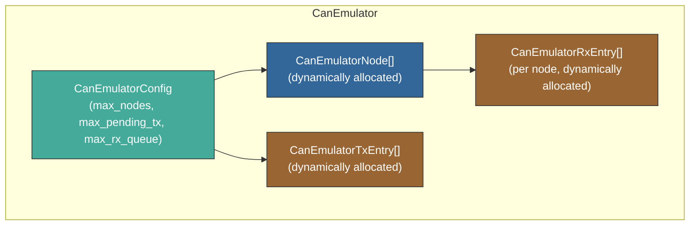
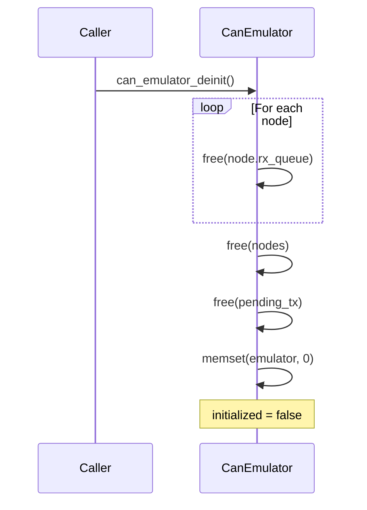
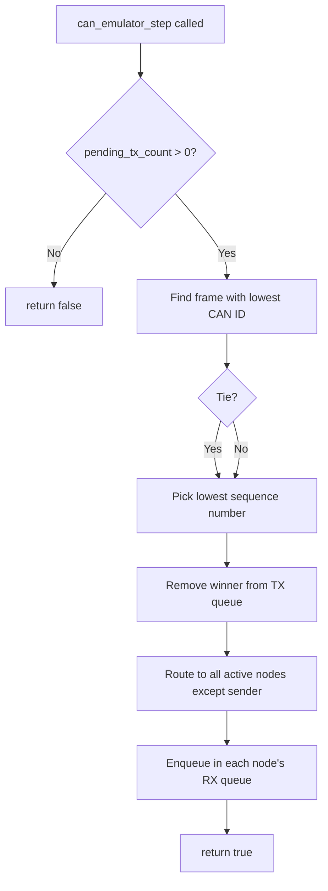

# CAN Emulator — Software Design Document

## 1. Purpose

The CAN emulator provides a deterministic in-memory virtual CAN bus for SIL
simulation. It models CAN controller hardware behavior — TX arbitration,
broadcast routing, and per-node RX queuing — so that applications experience
realistic CAN bus semantics without physical hardware.

## 2. Architecture



All internal arrays are dynamically allocated at init time based on the
`CanEmulatorConfig` provided by the caller. No compile-time size limits exist.

## 3. Dynamic Resource Management

### 3.1 Initialization

`can_emulator_init()` takes a `CanEmulatorConfig` and allocates:

| Resource | Count | Element type |
|----------|-------|-------------|
| Nodes table | `max_nodes` | `CanEmulatorNode` |
| TX pending queue | `max_pending_tx` | `CanEmulatorTxEntry` |
| RX queue per node | `max_nodes × max_rx_queue` | `CanEmulatorRxEntry` |

If any allocation fails, all previously allocated memory is freed and the
function returns `false`. The emulator is not left in a partial state.

### 3.2 Deinitialization

`can_emulator_deinit()` frees all resources in reverse order:



After deinit, the emulator struct is zeroed and safe to reinitialize.

### 3.3 Initialization Safety

All functions check `emulator->initialized` before operating. An uninitialized
or deinitialized emulator rejects all operations gracefully (returns `false`
or `0`).

## 4. Arbitration



- **Priority**: Lowest CAN ID wins (matches real CAN bus CSMA/CD+AMP)
- **Tie-break**: Submission order via monotonic sequence counter
- **Routing**: Broadcast to all nodes except the sender
- **Stepping**: One frame per `can_emulator_step()` call for deterministic control

## 5. Configuration

```c
CanEmulatorConfig config = {
    .max_nodes      = 4,    /* number of bus participants */
    .max_pending_tx = 32,   /* TX buffer depth */
    .max_rx_queue   = 16,   /* RX FIFO depth per node */
};
```

Typical sizing guidelines:

| Use case | max_nodes | max_pending_tx | max_rx_queue |
|----------|-----------|----------------|--------------|
| Point-to-point (vcan_config) | 2 | 16 | 16 |
| Small network | 4–8 | 32 | 32 |
| Full vehicle bus | 16 | 64 | 64 |

## 6. API Reference

| Function | Description |
|----------|-------------|
| `can_emulator_init(emu, config)` | Allocate and initialize with given capacity |
| `can_emulator_deinit(emu)` | Free all resources |
| `can_emulator_register_node(emu, id)` | Add a node to the virtual bus |
| `can_emulator_submit(emu, sender, frame)` | Enqueue a frame for arbitration |
| `can_emulator_step(emu)` | Arbitrate and route one winning frame |
| `can_emulator_receive(emu, receiver, frame, sender)` | Dequeue one frame from a node's RX queue |
| `can_emulator_pending_tx_count(emu)` | Query pending TX queue depth |

## 7. File Structure

| File | Role |
|------|------|
| `can_emulator/can_emulator.h` | Public API and types |
| `can_emulator/can_emulator.c` | Implementation |
| `can_emulator/test/test_can_emulator.c` | Unit tests |

## 8. Verification

```powershell
Set-Location test
ruby -S ceedling test:can_emulator
```
