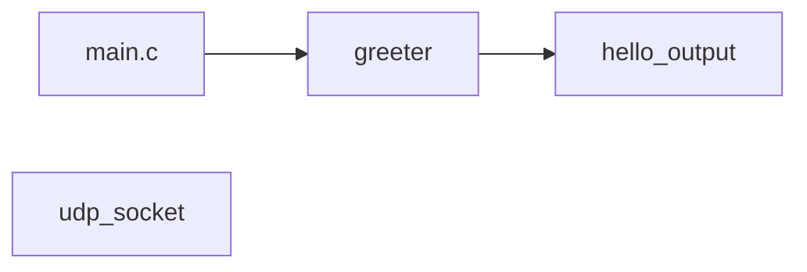
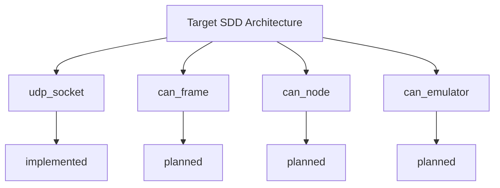
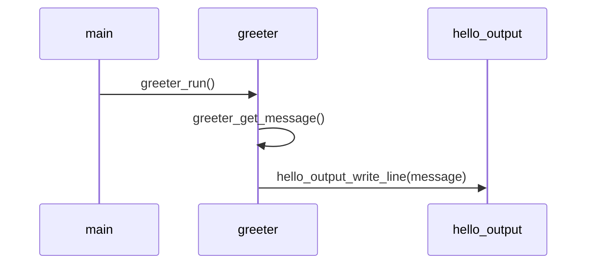
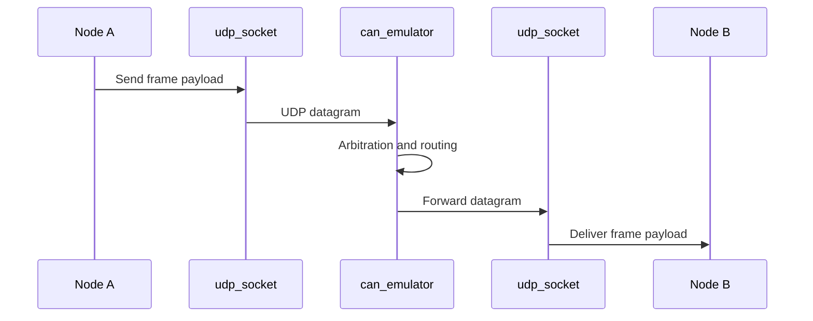

# SW Software Design Description (SDD)

This document is an expanded software design description for the `sw/` layer. It is based on the CAN UDP SDD document and updated to reflect what is currently implemented in this repository.

## 1. Purpose

The SW layer provides reusable C modules for:

- application-level message flow (`main` -> `greeter` -> `hello_output`)
- UDP communication primitives (`udp_socket`) for CAN-over-UDP simulation
- future extension toward a full CAN node and CAN emulator stack

Primary goal: enable software-only CAN behavior experimentation without physical CAN hardware.

## 2. Scope

### In Scope (Current)

- production demo flow using `greeter` and `hello_output`
- UDP socket abstraction on Windows
- non-blocking receive mode and receive timeout configuration
- module-level unit testing via Ceedling + Unity + CMock

### In Scope (Planned)

- `can_frame` representation
- `can_node` send/receive logic
- `can_emulator` arbitration, routing, and broadcast behavior

### Out of Scope (Current)

- CAN FD support
- fault/error injection
- trace logging and replay
- GUI tooling

## 3. Design Goals

- C implementation usable from both C and C++
- modular boundaries and testable units
- transport abstraction that can later be replaced with real CAN backend
- deterministic behavior for arbitration and timing models

## 4. Architecture Overview

### Current Structure



### Target SDD Structure



## 5. Module Inventory

| Module | Path | Responsibility | Status |
|---|---|---|---|
| `main` | `sw/main.c` | production entry point | implemented |
| `greeter` | `sw/greeter` | message source and app behavior | implemented |
| `hello_output` | `sw/hello_output` | output sink abstraction | implemented |
| `udp_socket` | `sw/udp_socket` | UDP transport abstraction | implemented |
| `can_frame` | planned | frame payload model | planned |
| `can_node` | planned | node API and transport usage | planned |
| `can_emulator` | planned | arbitration/routing/broadcast | planned |

## 6. Control and Data Flows

### 6.1 Current Production Flow



### 6.2 Target CAN over UDP Flow



## 7. Public Interface Contracts

### 7.1 greeter

- `const char *greeter_get_message(void)`
- `void greeter_run(void)`

Contract intent:

- returns a stable "Hello, World!" message
- delegates output to `hello_output`

### 7.2 hello_output

- `void hello_output_write_line(const char *message)`

Contract intent:

- writes one line of text to output sink

### 7.3 udp_socket

- `bool udp_socket_init(UdpSocket *udp, uint16_t local_port)`
- `bool udp_socket_send_to(const UdpSocket *udp, const char *ip, uint16_t remote_port, const void *data, size_t data_len)`
- `bool udp_socket_set_non_blocking(UdpSocket *udp, bool enabled)`
- `bool udp_socket_set_receive_timeout(UdpSocket *udp, uint32_t timeout_ms)`
- `int udp_socket_receive_from(UdpSocket *udp, void *buffer, size_t buffer_len, char *sender_ip, size_t sender_ip_len, uint16_t *sender_port)`
- `void udp_socket_close(UdpSocket *udp)`

Contract intent:

- all configuration operations fail fast on invalid or uninitialized socket
- receive returns payload size on success, `-1` on failure/timeout/no data depending on mode

## 8. CAN Data Model and Behavior (From SDD)

### 8.1 Planned Frame Model

```c
typedef struct {
  uint32_t id;
  uint8_t  dlc;
  uint8_t  data[8];
  uint8_t  flags;
} CanFrame;
```

### 8.2 Arbitration Rule

- lower CAN ID has higher priority
- if IDs are equal, earliest timestamp wins

Reference decision logic:

```c
if (a->frame.id < b->frame.id) {
  winner = a;
}
```

### 8.3 Timing Rule

The SDD timing model:

$$
bits = 47 + (8 \times dlc)
$$

$$
tx\_time\_us = \frac{bits \times 1{,}000{,}000}{bitrate}
$$

## 9. Platform and Constraints

- primary target: Windows C/C++ runtime
- UDP transport implemented for `_WIN32`
- non-Windows path currently returns failure stubs for UDP module

## 10. Testing Strategy

Unit tests are organized per module under `sw/**/test` and run with Ceedling.

- framework: Unity
- mocking: CMock
- discovery: all files named `test_*.c`

Run tests:

```powershell
Set-Location test
ruby -S ceedling test:all
```

Current validated result: 9 tests passed.

## 11. Traceability Matrix

| SDD Item | Current Implementation |
|---|---|
| UDP send/receive abstraction | `udp_socket` implemented |
| Non-blocking receive | implemented |
| Receive timeout configuration | implemented |
| CAN frame data structure | planned |
| CAN node API | planned |
| CAN emulator arbitration/routing | planned |
| Arbitration rule (ID + timestamp) | documented, planned |
| Bitrate-based timing model | documented, planned |

## 12. Risks and Open Items

- non-Windows portability currently incomplete for `udp_socket`
- no integration-level emulator tests yet (only module-level tests)
- arbitration and timing are defined but not yet coded

## 13. Roadmap

1. Add `can_frame` module and tests
2. Add `can_node` API for frame send/receive over `udp_socket`
3. Add `can_emulator` with arbitration and route/broadcast behavior
4. Implement timing simulation hooks using bitrate and DLC
5. Add multi-node scenario tests and replayable validation traces
