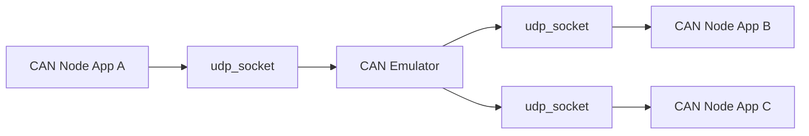
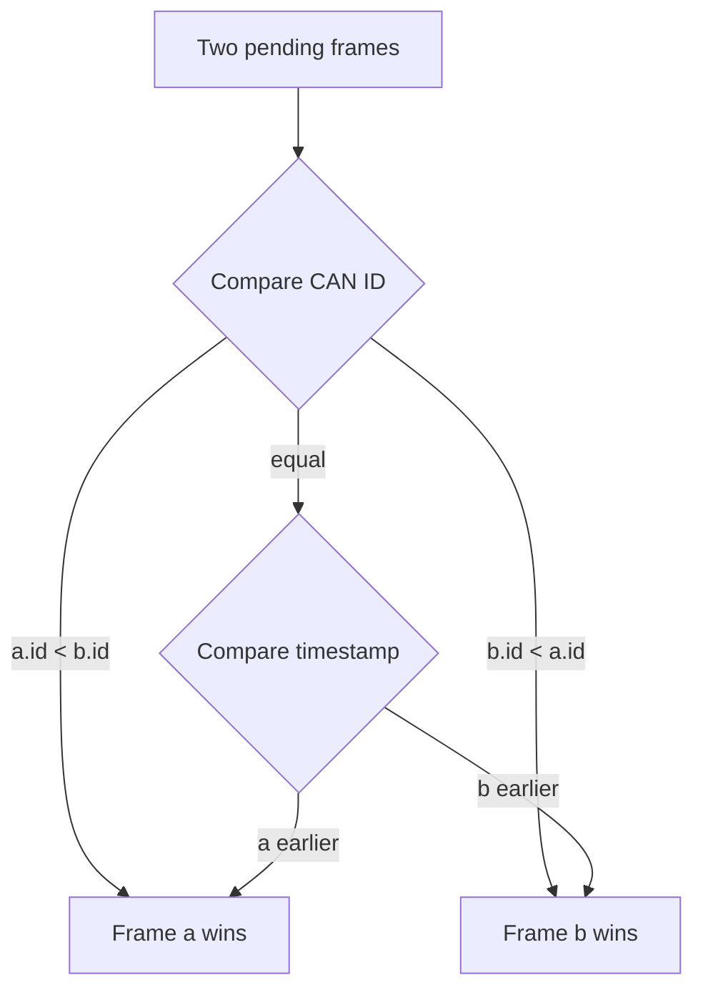

# Software Design Document (SDD)

## UDP-Based CAN Emulator Libraries for Windows C/C++

## 1. Purpose

This software provides reusable C libraries for UDP communication and CAN bus emulation.
It enables multiple Windows applications to behave like CAN nodes without requiring physical CAN hardware.

## 2. System Overview

Applications communicate via a central CAN emulator over UDP.
The emulator handles arbitration, routing, and broadcast of CAN frames.



## 3. Design Goals

- Written in C
- Usable from C and C++
- Modular and testable
- Replaceable with real CAN hardware later
- Supports arbitration and CAN-like behavior

## 4. Library Structure

Target library structure:

```text
libs/
  udp_socket.h
  udp_socket.c
  can_frame.h
  can_node.h
  can_node.c
  can_emulator.h
  can_emulator.c
```

Repository mapping under `sw/`:

- implemented: `udp_socket`
- planned: `can_frame`, `can_node`, `can_emulator`

## 5. UDP Socket Module

Provides generic UDP send/receive functionality.

```c
bool udp_socket_init(UdpSocket* udp, uint16_t local_port);
bool udp_socket_send_to(...);
int  udp_socket_receive_from(...);
void udp_socket_close(UdpSocket* udp);
```

## 6. CAN Frame

```c
typedef struct {
    uint32_t id;
    uint8_t  dlc;
    uint8_t  data[8];
    uint8_t  flags;
} CanFrame;
```

## 7. CAN Arbitration

CAN arbitration is based on ID priority.

- Lower ID wins
- If IDs are equal, earliest timestamp wins

```c
if (a->frame.id < b->frame.id)
    winner = a;
```



## 8. Bus Timing

```c
uint32_t bits = 47 + (8 * dlc);
tx_time_us = bits * 1000000 / bitrate;
```

Where:

- `dlc` is the frame payload byte count
- `bitrate` is bits per second
- `tx_time_us` is transmit time in microseconds

## 9. Example C Usage

```c
CanFrame tx = {
    .id = 0x100,
    .dlc = 3,
    .data = {0x11, 0x22, 0x33}
};

can_node_send(&node, &tx);
```

## 10. Example C++ Usage

```cpp
CanNodeCpp node(6001, "127.0.0.1", 5000);
node.send(0x120, data, 2);
```

## 11. Direct UDP Example

```c
udp_socket_send_to(&udp, "127.0.0.1", 7002, message, sizeof(message));
```

## 12. Future Extensions

- CAN FD support
- Error simulation
- Logging and replay
- GUI tools
