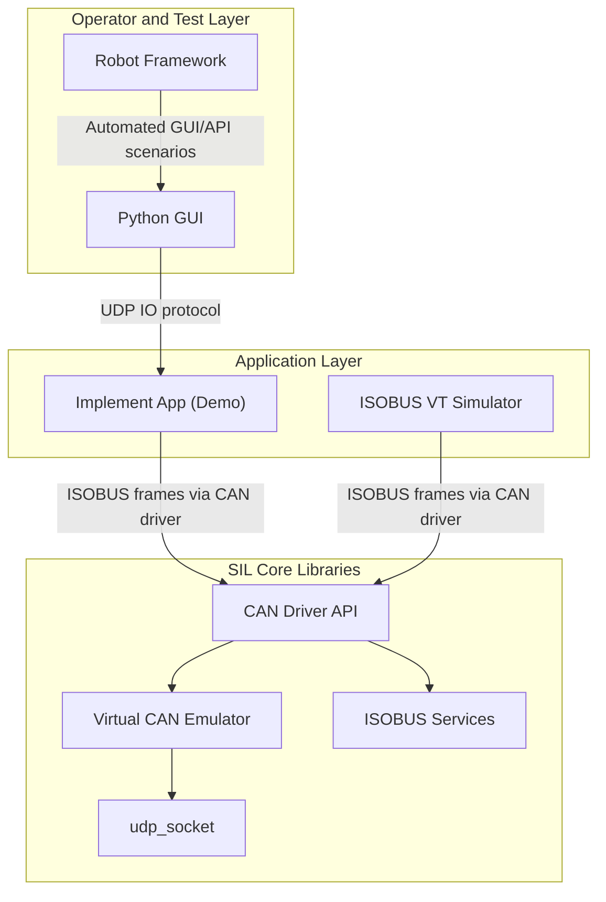

# Implement SIL Platform Architecture

---

## Table of Contents

1. [Purpose](#1-purpose)
2. [Scope and End Goal](#2-scope-and-end-goal)
3. [Acronyms and Abbreviations](#3-acronyms-and-abbreviations)
4. [References](#4-references)
5. [System Overview](#5-system-overview)
6. [Architectural Principles](#6-architectural-principles)
   - 6.1 [Single Responsibility](#61-single-responsibility)
   - 6.2 [Open/Closed](#62-openclosed)
   - 6.3 [Liskov and Interface Segregation](#63-liskov-and-interface-segregation)
   - 6.4 [Dependency Inversion](#64-dependency-inversion)
7. [Functional Building Blocks](#7-functional-building-blocks)
   - 7.1 [Implement Demo Application](#71-implement-demo-application)
   - 7.2 [Virtual Terminal Simulator](#72-virtual-terminal-simulator)
   - 7.3 [Python GUI and Automation Interface](#73-python-gui-and-automation-interface)
   - 7.4 [Virtual CAN Emulator Stack](#74-virtual-can-emulator-stack)
8. [Communication Model](#8-communication-model)
   - 8.1 [ISOBUS and VT Object-Pool Flow](#81-isobus-and-vt-object-pool-flow)
   - 8.2 [Direct IO UDP Protocol](#82-direct-io-udp-protocol)
9. [Verification Strategy](#9-verification-strategy)
   - 9.1 [Manual Verification](#91-manual-verification)
   - 9.2 [Automated Verification (Robot Framework)](#92-automated-verification-robot-framework)
10. [Target Module Structure (Platform View)](#10-target-module-structure-platform-view)
11. [Component SDD Plan](#11-component-sdd-plan)
12. [Roadmap](#12-roadmap)
13. [Future Extensions](#13-future-extensions)

**Appendices**

- [Appendix A: Benefits of the SIL System](#appendix-a-benefits-of-the-sil-system)
- [Appendix B: Agricultural Implement Background](#appendix-b-agricultural-implement-background)

---

## 1. Purpose

This document defines the top-level architecture for a Software-in-the-Loop (SIL) platform used to develop and validate an implement application.

The platform enables:

- Interactive operation by a human user
- Automated operation by Robot Framework system tests
- Virtual ISOBUS communication with a Virtual Terminal simulator
- Direct IO control through a Python GUI protocol over UDP

The implement application in this phase is intentionally simple and serves as a reference implementation that demonstrates the SIL platform behavior.

## 2. Scope and End Goal

The end goal is a reusable SIL ecosystem where implement logic, ISOBUS interactions, and IO stimulation can be exercised without physical hardware.

The target end-state is a platform where the same implement behavior can be validated through:

- Manual operation by an engineer through a Python GUI
- Automated operation by Robot Framework end-to-end tests
- Implement ISOBUS interaction with a Virtual Terminal simulator
- Deterministic protocol-level observability for pass/fail decisions in CI

At maturity, this SIL platform should allow teams to verify the majority of implement communication and IO behavior before moving to hardware benches or field tests.

Concretely, the platform is considered successful when:

- Implement startup, VT session establishment providing full HMI
- Implement IO can be driven and observed through a stable UDP protocol contract
- ISOBUS/CAN exchanges are traceable and reproducible across local and CI environments
- Core modules can evolve independently through SOLID boundaries without breaking test suites

In scope for this SDD:

- Platform-level architecture and boundaries
- Core module responsibilities and dependencies
- Communication paths (ISOBUS/CAN path and direct IO path)
- SOLID-oriented module design strategy for C components

Out of scope for this SDD:

- Detailed low-level design of each module
- Full VT object-pool content definition
- Full GUI implementation details

These details will be provided in dedicated component SDDs.

## 3. Acronyms and Abbreviations

| Acronym | Expansion | Notes |
|---------|-----------|-------|
| **CAN** | Controller Area Network | ISO 11898 physical/data-link bus standard |
| **CI** | Continuous Integration | Automated build and test pipeline |
| **DIP** | Dependency Inversion Principle | One of the SOLID principles |
| **GUI** | Graphical User Interface | |
| **HIL** | Hardware-in-the-Loop | Test environment using real ECU hardware |
| **HMI** | Human-Machine Interface | Operator interaction panel |
| **IO** | Input/Output | Physical or simulated signals |
| **ISOBUS** | ISO 11783 | CAN-based networking standard for agricultural machinery |
| **ISP** | Interface Segregation Principle | One of the SOLID principles |
| **JSON** | JavaScript Object Notation | Text serialization format used in UDP IO protocol |
| **LSP** | Liskov Substitution Principle | One of the SOLID principles |
| **OCP** | Open/Closed Principle | One of the SOLID principles |
| **PGN** | Parameter Group Number | ISOBUS/J1939 message identifier field |
| **RF** | Robot Framework | Open-source keyword-driven test automation framework |
| **SDD** | Software Design Document | This document |
| **SIL** | Software-in-the-Loop | Test environment using software models only, no hardware |
| **SOLID** | SRP, OCP, LSP, ISP, DIP | Five object-oriented design principles (Robert C. Martin) |
| **SRP** | Single Responsibility Principle | One of the SOLID principles |
| **UDP** | User Datagram Protocol | Connectionless network transport layer |
| **VT** | Virtual Terminal | ISOBUS operator interface device (ISO 11783-6) |

## 4. References

| ID | Reference | Relevance |
|----|-----------|----------|
| [1] | ISO 11783 (ISOBUS) — Agricultural machinery — Electronic communications | Governing standard for all ISOBUS communication in this platform |
| [2] | ISO 11783-6 — Virtual Terminal | Defines the VT protocol and object-pool upload procedure |
| [3] | SAE J1939 — Serial Control and Communications Heavy Duty Vehicle Network | Basis for ISOBUS transport and addressing |
| [4] | CAN 2.0B — Robert Bosch GmbH | CAN frame format used as the underlying frame model |
| [5] | Robert C. Martin — *Clean Code* | Foundation for SOLID principles applied to this design |
| [6] | Robert C. Martin — *Clean Architecture* | Layered architecture and dependency inversion strategy |
| [7] | Robot Framework User Guide — robotframework.org | Test automation framework used for SIL verification |
| [8] | Wikipedia — [Software-in-the-Loop (SIL)](https://en.wikipedia.org/wiki/Software-in-the-loop) | Background overview of SIL simulation methodology |
| [9] | Wikipedia — [User Datagram Protocol (UDP)](https://en.wikipedia.org/wiki/User_Datagram_Protocol) | Background overview of the UDP transport used for virtual CAN and IO protocol |
| [10] | Wikipedia — [ISOBUS](https://en.wikipedia.org/wiki/ISOBUS) | Background overview of the ISOBUS standard and its role in agricultural machinery |

## 5. System Overview

The SIL system has two complementary interaction paths:

- ISOBUS path: Implement app communicates with a Virtual Terminal simulator through the CAN driver and virtual CAN emulator.
- Direct IO path: Python GUI (and Robot Framework-driven flows) writes/reads implement IO over a defined UDP protocol using the UDP socket layer.



## 6. Architectural Principles

The SIL core modules follow SOLID principles to keep the architecture extensible and testable.

### 6.1 Single Responsibility

- `can_driver`: public CAN interaction boundary
- `can_emulator`: arbitration/routing behavior
- `isobus_vt_service`: VT-oriented ISOBUS messaging
- `udp_socket`: transport primitive
- `implement_app`: domain behavior and IO mapping

### 6.2 Open/Closed

The implement app and tests depend on stable interfaces; transports and emulator strategies can evolve without changing application logic.

### 6.3 Liskov and Interface Segregation

Interfaces are narrow and role-specific (driver, transport, VT service, IO bridge), enabling mocks and substitutions in tests.

### 6.4 Dependency Inversion

High-level modules (`implement_app`, test harnesses) depend on abstractions, not concrete UDP or emulator internals.

## 7. Functional Building Blocks

### 7.1 Implement Demo Application

Responsibilities:

- Maintain simplified implement IO and state
- Exchange ISOBUS messages with VT simulator
- Publish and consume IO via UDP protocol endpoint

Constraints:

- Keep implementation intentionally simple
- Optimize for demonstrability and testability, not production completeness

### 7.2 Virtual Terminal Simulator

Responsibilities:

- Behave as ISOBUS Virtual Terminal peer
- Receive object-pool upload from implement via ISOBUS over CAN driver
- Send VT-originated commands/events used by scenarios

### 7.3 Python GUI and Automation Interface

Responsibilities:

- Provide manual IO controls and status views
- Expose deterministic behavior suitable for Robot Framework automation
- Use predefined UDP protocol for implement IO read/write

### 7.4 Virtual CAN Emulator Stack

Responsibilities:

- Provide virtual CAN bus behavior for SIL
- Apply arbitration (lower CAN ID priority, deterministic tie-break policy)
- Route frames across participating nodes

Core modules:

- `can_frame`
- `can_driver`
- `can_emulator`
- `isobus_services`
- `can_transport_udp` (internal)
- `udp_socket` (transport primitive)

## 8. Communication Model

### 8.1 ISOBUS and VT Object-Pool Flow

At startup and VT session establishment:

1. Implement application initializes CAN driver and ISOBUS services.
2. Implement application uploads its VT object pool to the VT simulator.
3. VT simulator acknowledges and enters operational exchange.
4. Runtime VT commands/events are exchanged through ISOBUS messages.

The object-pool upload path is part of the required SIL behavior and must be verifiable in automated tests.

### 8.2 Direct IO UDP Protocol

The Python GUI communicates directly with the implement app over UDP using a predefined protocol.

Protocol intent:

- Write implement IO inputs (command)
- Read implement IO and state outputs (status)
- Support both manual and automated control loops

Example envelope shape (informative):

```json
{
  "type": "command",
  "timestamp": 0,
  "payload": {
    "auger_enable": true,
    "engine_rpm": 1800
  }
}
```

## 9. Verification Strategy

### 9.1 Manual Verification

- Operator drives IO through Python GUI
- Operator verifies VT simulator behavior
- Operator observes implement responses and state progression

### 9.2 Automated Verification (Robot Framework)

Robot Framework scenarios should validate end-to-end behavior:

- IO command to implement via GUI/protocol path
- Implement state transition correctness
- ISOBUS exchange with VT simulator
- VT object-pool upload success criteria

Automation expectations:

- Deterministic startup and shutdown
- Stable, parseable protocol payloads
- Explicit pass/fail observability points

## 10. Target Module Structure (Platform View)

```text
sw/
  app_implement/
  can_driver/
  can_emulator/
  can_frame/
  isobus_services/
  can_transport_udp/
  udp_socket/
tools/
  vt_simulator_cpp/
  gui_python/
test/
  robot/
```

Current baseline:

- Implemented: `udp_socket`
- Planned: all other platform modules listed above

## 11. Component SDD Plan

This document is the master architecture SDD.

Each layer/component will have its own SDD for detailed design:

- Implement App SDD
- VT Simulator SDD
- CAN Driver SDD
- CAN Emulator SDD
- ISOBUS Services SDD
- UDP IO Protocol SDD
- Python GUI SDD
- Robot Framework Test Architecture SDD

## 12. Roadmap

1. Define stable interfaces for core modules (`can_driver`, `can_emulator`, `isobus_services`).
2. Implement minimal implement app with deterministic IO state model.
3. Implement VT simulator integration including object-pool upload handling.
4. Implement Python GUI with UDP protocol adapter for manual control.
5. Implement Robot Framework end-to-end test suites.
6. Expand module-level SDDs and harden platform behavior.

## 13. Future Extensions

- Replace UDP transport with real CAN hardware transport
- Add richer implement behavior and fault handling
- Support additional implement types in the same SIL framework
- Add logging/replay and fault injection for regression testing

---

## Appendix A: Benefits of the SIL System

### Engineering Benefits

- Faster development feedback by testing communication and IO logic without waiting for hardware availability
- Better modularity and maintainability due to SOLID separation between driver, emulator, ISOBUS services, and app logic
- Safer refactoring because deterministic system tests can quickly detect regressions

### Verification Benefits

- Repeatable end-to-end validation with Robot Framework for key user and protocol scenarios
- Early validation of VT object-pool upload and VT interaction flow before integration labs
- Improved defect localization by separating direct IO path failures from ISOBUS path failures

### Program and Business Benefits

- Reduced integration risk when transitioning from SIL to HIL/vehicle/field environments
- Lower cost of testing by reducing dependence on scarce physical CAN/ISOBUS setups
- Higher release confidence through consistent manual + automated verification coverage

### Scalability Benefits

- Same architecture can support additional implements with minimal platform changes
- Transport layer can later be swapped from UDP emulation to real CAN hardware while preserving higher-level tests
- Component-level SDD strategy allows teams to parallelize development and design reviews

---

## Appendix B: Agricultural Implement Background

In the agricultural world, an **implement** is any piece of machinery or equipment that is attached to, towed by, or powered by a tractor or self-propelled vehicle to perform a specific farming task.

Common examples include:

| Implement | Primary Function |
|-----------|------------------|
| **Baler** | Collects cut crop material (hay, straw) and compresses it into compact bales for storage or transport |
| **Sprayer** | Distributes liquid chemicals (fertilizers, pesticides, herbicides) across a field |
| **Planter / Seeder** | Deposits seeds at controlled depth and spacing into prepared soil |
| **Combine Harvester** | Reaps, threshes, and winnows grain crops in a single pass |
| **Cultivator / Tillage** | Works the soil to prepare seed beds or control weeds |
| **Fertilizer Spreader** | Distributes granular or liquid fertilizers uniformly across a field |

### Relevance to This SIL Platform

In the context of this project, **implement** refers to any ISOBUS-capable working machine that:

- Communicates with a **Virtual Terminal (VT)** for operator interaction via ISO 11783-6
- Exposes physical **IO signals** (sensors, actuators, speeds, pressures) that can be driven and monitored
- Operates on a shared **ISOBUS/CAN network** alongside a tractor ECU and other field equipment

The demo application built on this SIL platform represents a simplified generic implement. The architecture is intentionally agnostic to the specific implement type so that different working machines (balers, sprayers, planters, etc.) can be substituted with minimal platform changes.
